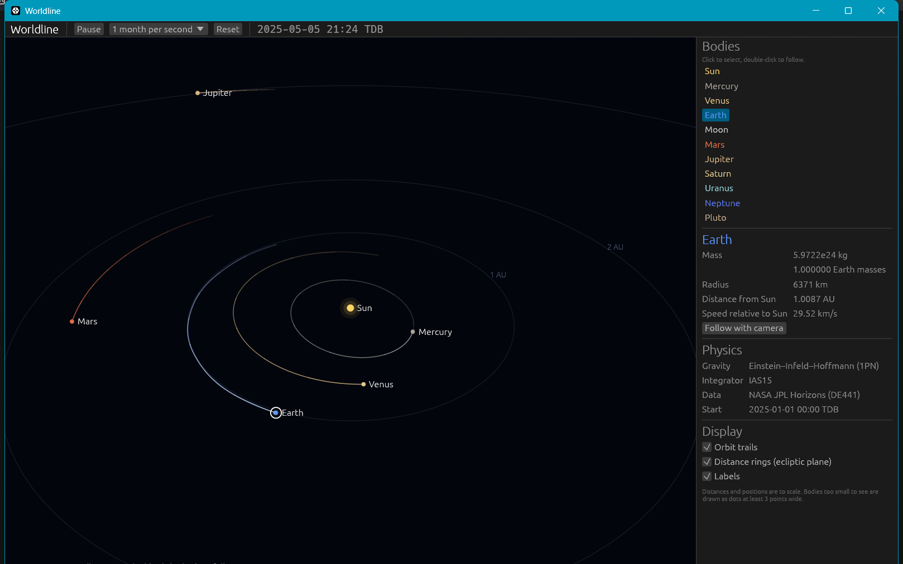
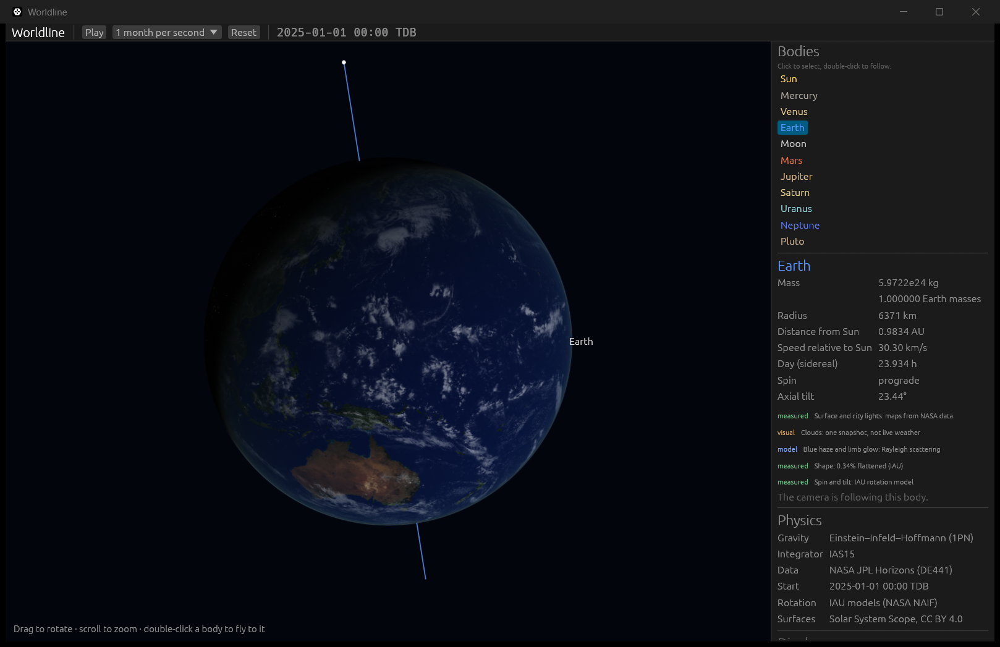
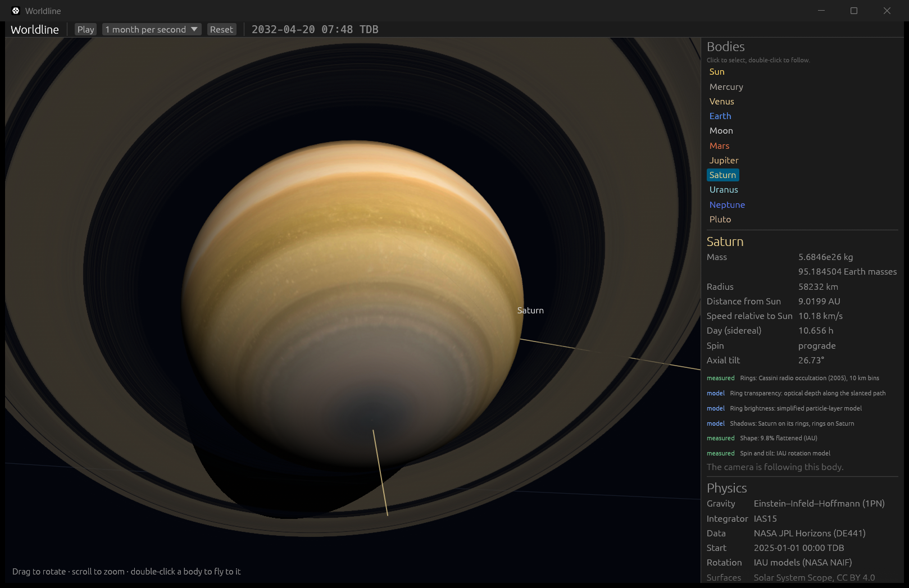
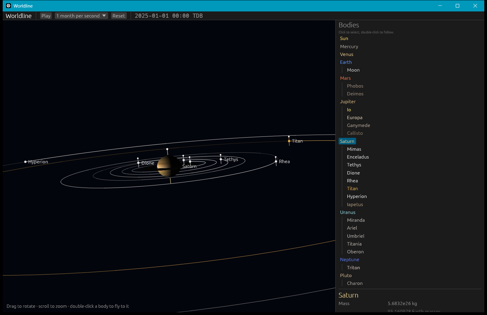
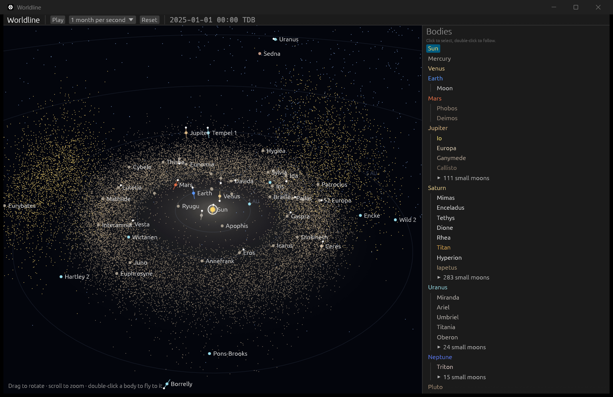
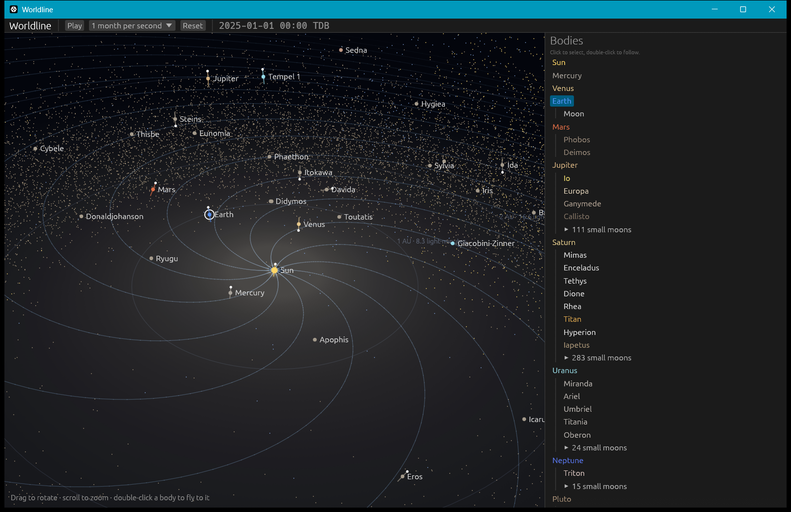
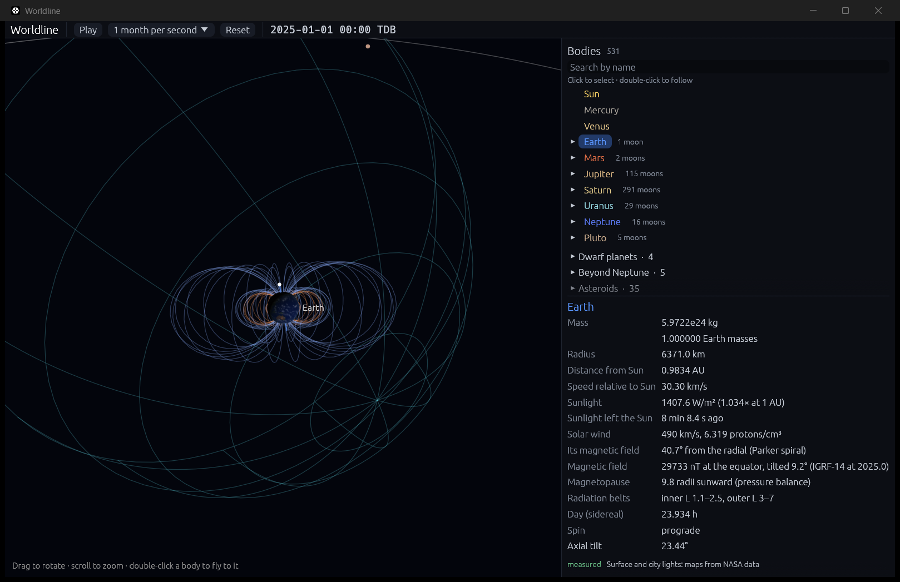
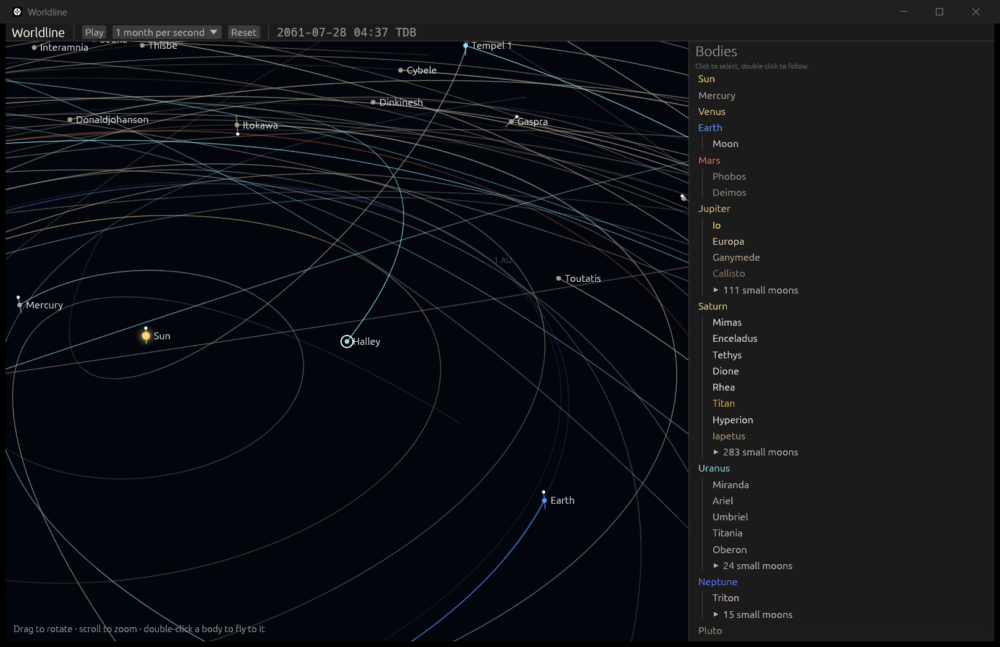

# Worldline

**A relativistic universe sandbox.** Drop black holes, neutron stars and planets into the real universe and watch general relativity play out. Every physics model is validated against theory and observation.

> **Status:** pre-alpha. The engine runs the real solar system in a 3D window, with relativistic gravity, all 459 of its known moons, 62 dwarf planets, asteroids and comets, 28,331 belt asteroids and Kuiper belt objects, the zodiacal dust, the Sun's reach (its wind, its heliosphere and its light), and the planets' magnetospheres. See the [roadmap](docs/ROADMAP.md).

















## What v1 will do

- Start from the real solar system (NASA JPL data) and a catalog of notable objects: Sagittarius A\*, TON 618, M87\* and the Hulse–Taylor binary pulsar.
- Add, drag and launch bodies, with time running anywhere from real time to millions of years per second.
- Simulate relativistic gravity: orbits precess, binaries spiral together by emitting gravitational waves, and black holes merge.
- Play the gravitational-wave chirp and show light bending around black holes.
- Show planets and stars torn apart by tides.
- Include quantum physics where it decides the outcome: white dwarf and neutron star mass limits, and Hawking evaporation.
- Always show which physics model is running, and warn when a scenario goes beyond known physics.

## Validated against reality

| Test | Expected | Status |
|---|---|---|
| Kepler's third law (Mercury, Earth and Jupiter orbit periods) | T = 2π √(a³/GM) | ✅ passing, to 1 part in 100 million |
| Energy conservation over 10,000 orbits (IAS15 integrator) | at the limit of double-precision rounding | ✅ passing, error 4 × 10⁻¹⁴ |
| One year of the real solar system vs. NASA JPL | Earth within 1 part in 10,000 | ✅ passing, Earth within 0.41 km with relativity (61 km without) |
| Mercury's perihelion precession (relativistic part) | 42.9805″ per century | ✅ passing, 42.9807″ per century |
| Planets' axial tilts (IAU rotation models plus simulated orbits) | NASA Planetary Fact Sheet | ✅ passing, all within 0.05° |
| Mercury's 3:2 spin–orbit resonance | 3 spins per 2 orbits | ✅ passing, ratio 1.50000 |
| The Moon keeps one face toward Earth (libration) | ±7.9° longitude, ±6.7° latitude at most | ✅ passing, −5.6° to +5.2°, −6.6° to +6.7° |
| Where the Sun is overhead on 1 Jan 2025, 00:00 TDB | about 23.0°S, 179°W | ✅ passing, 23.00°S, 178.76°W |
| Saturn's rings edge-on to Earth | 23 March 2025 | ✅ passing, +0.73 days |
| Saturn's equinox (Sun crosses the ring plane) | 6 May 2025 | ✅ passing, +0.54 days |
| Cassini-measured ring structure vs. PDS boundaries | B ring edge 117,570 km; empty Encke Gap | ✅ passing, 117,630 km (edge oscillates ±70 km); τ = 0.000 |
| 21 major moons after 30 days vs. NASA JPL | each within its own radius | ✅ passing, 18 within 1.6 km; worst Mimas 13 km (radius 198 km) |
| Every moon in JPL's list loads | 459 | ✅ passing, 459 (1 Moon, 21 major, 437 small) |
| Small moons after 30 days vs. NASA JPL, spot checks with measured sizes | each within its own radius | 🟨 41 of 48; 7 listed residuals (Epimetheus, four Saturn moonlets, Styx, Kerberos), 3–62 km |
| Janus and Epimetheus trade orbits | January 2026 | ✅ passing, 30 January 2026 |
| Phobos and Deimos need Mars's lumpy (Tharsis) gravity | off by more than their size without it | ✅ passing, 108 and 175 km without, 0.10 and 0.28 km with |
| Io–Europa–Ganymede Laplace resonance, after nudging Io | φ librates about 180° with a period of about 2071 days | ✅ passing, swings 148°–213°, period 2045 days |
| The heaviest asteroids' pull brings Mars closer to JPL | smaller error with them | ✅ passing, Mars 0.19 → 0.11 km after a year (Earth 0.41 → 0.21 km) |
| 62 dwarf planets, asteroids and comets after one year vs. NASA JPL | within 1 part in 10,000 | ✅ passing, 61 within 0.2 km; Bennu 2,420 km (1.5 × 10⁻⁵), a listed residual |
| Halley's Comet returns | July 2061 (JPL: 28 July) | ✅ passing, 28 July 2061, 17 minutes from JPL's time |
| Kirkwood gaps in 19,971 real main-belt asteroids | gaps at Jupiter's 3:1, 5:2, 7:3 and 2:1 resonances, beyond 5σ | ✅ passing, −13.4σ, −11.8σ, −12.1σ, −17.3σ |
| Jupiter's Trojans (4,509) | clustered 60° ahead of and behind Jupiter | ✅ passing, medians +62.0° and −61.9° |
| Hildas and Plutinos crowd into 3:2 resonances (Jupiter's and Neptune's) | an excess beyond 5σ | ✅ passing, +138σ and +26σ |
| Zodiacal dust model (COBE) vs. Helios | brightens toward the Sun as R^−(2.3 ± 0.1) | ✅ passing, R^−2.30 to R^−2.38 |
| Sunlight at 1 AU vs. NASA SORCE | 1360.8 ± 0.5 W/m² | ✅ passing, 1361.17 W/m² (2025 average at the simulated Earth: 1361.3) |
| Light travel time, Sun to Earth | 8.3 minutes | ✅ passing, 8.318 min averaged over 2025, plus 53 µs of Shapiro delay |
| Parker spiral vs. a year of solar wind measured at Earth (NASA OMNI) | agreement within 3 standard errors | ✅ passing, measured 44.3°, predicted 41.9°, daily difference +2.0° ± 1.2° |
| Voyager heliosphere crossings, JPL positions vs. published distances | within 0.05 AU | ✅ passing, all four (94.0, 83.7, 121.6, 119.0 AU) |
| Earth's magnetopause from pressure balance | about 10 Earth radii sunward | ✅ passing, 9.84 Earth radii in 2025's average wind |
| Magnetopause, hour by hour through 2025, vs. Shue et al.'s fit to spacecraft crossings | within their 1.23 Earth radii scatter | ✅ passing, RMS difference 0.26 Earth radii |
| A Jupiter-mass planet dropped at 1.5 AU: energy and momentum over 10 years | conserved to the (v/c)² ≈ 4 × 10⁻⁸ of relativity | ✅ passing, 1.9 × 10⁻¹⁰ and 1.8 × 10⁻¹¹ |
| Save and load | lossless | ✅ passing, loads back bit for bit |
| Two bodies collide and merge (Newtonian gravity) | total momentum before = after | ✅ passing, to 1 × 10⁻¹⁶ (rounding) |
| A comet falling into the Sun from 1 AU at 50 km/s | caught at the surface: 618.3 km/s after 24.6177 days (energy conservation, radial Kepler orbit) | ✅ passing, 618.3 km/s after 24.6177 days |
| A Jupiter-mass body hits Mars (real solar system, relativistic gravity) | Mars absorbed, Phobos and Deimos freed, momentum kept | ✅ passing, moons freed by its tides first; momentum to 1.1 × 10⁻¹¹ |
| Sagittarius A\*, TON 618, M87\* and PSR B1913+16 load with published masses | 4.297 × 10⁶, 10^10.82, 6.5 × 10⁹, 1.438 and 1.390 Suns | ✅ passing, exactly |
| Sirius B's gravitational redshift, from its mass and radius | 80.65 ± 0.77 km/s (Hubble) | ✅ passing, 80.70 ± 1.41 km/s |
| Sagittarius A\*'s size on the sky, from its mass and distance (stellar orbits) | 4.8 +1.4/−0.7 μas (Event Horizon Telescope image) | ✅ passing, 5.12 μas |
| Hulse–Taylor pulsar's orbit turning, simulated | 4.226585°/yr measured | ✅ passing, 4.226561°/yr |
| Hulse–Taylor pulsar's orbit shrinking from gravitational waves, simulated over 1000 orbits | −2.40 × 10⁻¹² s/s; general relativity's prediction −2.40263 × 10⁻¹² (Weisberg & Huang 2016), within mass rounding | ✅ passing, −2.40221 × 10⁻¹² (1.1σ from the measured −2.398 ± 0.004) |
| A pair's energy loss vs. Einstein's quadrupole formula and its first correction | equal up to second post-Newtonian order | ✅ passing, 6.0 × 10⁻⁵ at GM/rc² = 0.003 (6.7 (GM/rc²)²) |
| GW150914 replayed: its two black holes spiral in from 20 Hz and merge (numerical-relativity fits) | about 62 M☉, spin about 0.67; LIGO: 62 ± 4 M☉, spin 0.67 +0.05/−0.07, 3.0 ± 0.5 M☉ radiated | ✅ passing, 63.03 M☉, spin 0.683, 3.17 M☉ radiated; kick 43 km/s; rings down at 271 Hz |
| Two neutron stars' chirp, 20 to 40 Hz (3,927 wave cycles) | the sweep df/dt = (96/5) π^(8/3) (G𝓜/c³)^(5/3) f^(11/3), to its next order; with its first correction, to the one after | ✅ passing, 3.2 GM/rc² off the formula (2.8% at 20 Hz); 0.24% off with its correction (30 (GM/rc²)²) |
| Spacecraft maps of 12 moons, Pluto and Ceres are placed right: IAU Gazetteer landmarks | Sputnik Planitia, Cerealia Facula, Xanadu and Roncevaux Terra bright, Loki Patera dark, unlike a map turned halfway round | ✅ passing, e.g. Sputnik Planitia 158.8 against a 98.8 map average (114.0 turned) |
| Pluto and Charon face each other at longitude 0° (rotation models plus JPL positions) | within one map pixel, 0.176° | ✅ passing, 0.023° (NAIF's pck00011 values: 1.5°, so the New Horizons team's are used) |
| A black hole of 10 Suns falls into the Sun | survives as 11 Suns with a 32.5 km horizon, momentum kept | ✅ passing, to 4 × 10⁻¹⁷ |
| The belts as live particles vs. NASA JPL, after a year (24 sample bodies) | within 1 part in 10,000 | ✅ passing, median 2.3 × 10⁻⁶ (fixed ellipses: 1.6 × 10⁻⁴) |
| A black hole of 10 Suns streaks past the asteroid belt at 0.1c | kicks match the impulse approximation 2GM/(bV), within 1.3 × 10⁻³ | ✅ passing, within 9.1 × 10⁻⁴ |
| The star S2 around Sagittarius A\*: its orbit's relativistic turning | GRAVITY measured 0.997 ± 0.144 times general relativity's 12.2′ per orbit | ✅ passing, 12.26′ per orbit (1.005 times) |
| Sagittarius A\*'s direction in galactic coordinates | SIMBAD's l = 359.944236°, b = −0.046160°, within 0.0001° | ✅ passing, within 0.00002° |
| Light bending at the Sun's edge | 1.75″ | planned |
| Innermost stable orbit of a black hole, from orbits in its exact (Kerr) spacetime | 6 GM/c² without spin; 2.32 and 8.72 GM/c² with and against a spin of 0.9 (Bardeen, Press & Teukolsky) | ✅ passing: nudged orbits 0.5% outside keep circling, 0.5% inside plunge, at all three |
| Sagittarius A\* spirals into TON 618 (extreme mass ratio, 1 : 15,000) | shrinks at the adiabatic rate of circular orbits in TON 618's spacetime, then plunges at 6 GM/c² within about ν^(−1/5) orbits | ✅ passing, 3.8 × 10⁻⁵ from the rate (8.5 to 6.5 GM/c², 3,002 years); plunge in 4.4 orbits |
| Photon sphere and shadow of a non-spinning black hole | 3 and √27 GM/c² | planned |
| Chandrasekhar limit (ideal carbon-oxygen white dwarf), from the degenerate-electron equation of state | 1.46 M☉ | ✅ passing, 1.4563 M☉; ever denser white dwarfs approach it from below, short by 1/x² |
| Black holes evaporate (Hawking radiation, textbook model) | lifetimes t = 5120πG²M³/(ħc⁴); a 10⁸ kg hole in the simulation vanishes within a step of its 2.7 years | ✅ passing, to 10⁻¹²; 0.03 days late with 1-day steps |
| Maximum mass of a neutron star, SLy equation of state (general relativity's static stars) | about 2.05 M☉ | ✅ passing, 2.048 M☉; a 1.4 M☉ star is 11.71 km (both 0.05% from Read et al.) |
| Neutron stars that merge collapse at once above Bauswein et al.'s threshold | their fit within their 0.025 for all 12 of their equations of state; GW170817 (2.73 M☉) didn't, as its kilonova showed | ✅ passing, within 0.024; SLy's threshold 2.94 M☉ |
| Sirius B's radius from its measured mass (ideal cold carbon-oxygen white dwarf) | 0.00803 ± 0.00011 R☉ (Joyce et al. 2018) | ✅ passing, 0.00803 R☉: 5,583 km against 5,586 (0.03σ) |
| Tidal disruption radius | r_t ≈ R (M/m)^(1/3) | planned |

## Run it

You need [Rust](https://rustup.rs). From the repository root:

```bash
cargo run --release
```

The first build takes a few minutes. Then:
- drag to rotate,
- scroll to zoom,
- click a body to inspect it,
- double-click a body to fly to it.

To start already flown in to a body with time stopped:

```bash
cargo run --release -- --focus Earth --paused
```

To see Jupiter with its moons (`--zoom` puts the camera that many of the planet's radii away):

```bash
cargo run --release -- --focus Jupiter --zoom 40
```

To drop a Jupiter-mass planet between Earth and Mars and watch the orbits get disturbed (or use **Add a body** in the top bar, and drag to launch):

```bash
cargo run --release -- --add jupiter:1.5
```

To see Saturn's rings tilted toward the Sun in 2032 (`--advance` simulates that many years before starting):

```bash
cargo run --release -- --focus Saturn --advance 7.3
```

To see and hear the gravitational-wave chirp of GW170817's neutron stars, dropped 30 AU from the Sun (`--waves` opens the waves window; press **Play**):

```bash
cargo run --release -- --add "GW170817 pair:30" --focus "GW170817 heavier star" --paused --waves
```

To watch Sagittarius A\* spiral into TON 618, 15,000 times heavier, from ten times TON 618's GM/c² away (in TON 618's exact spacetime):

```bash
cargo run --release -- --add "TON 618:6600@Sagittarius A*" --focus "Sagittarius A*" --paused --waves
```

To replay GW150914, the first black-hole merger heard (press **Play** in the top bar; after 15 to 50 seconds of computing its last orbits, the two holes merge into one):

```bash
cargo run --release -- --add "GW150914 pair:30" --focus "GW150914 heavier hole" --paused --waves
```

## Built with

Rust · wgpu · egui · data from NASA JPL and NAIF · planet textures from Solar System Scope (CC BY 4.0) · moon, Pluto and Ceres maps from USGS and NASA PDS spacecraft mosaics. See [CREDITS.md](CREDITS.md).

## Docs

- [Scope](docs/SCOPE.md): what v1 includes and excludes, and why
- [Roadmap](docs/ROADMAP.md): milestones and steps
- [Architecture](docs/ARCHITECTURE.md): how the engine picks physics models
- [The desktop app](docs/app.md): frame loop, double-precision 3D view, camera, trails and the sandbox tools
- [Collisions and the model indicator](docs/physics/collisions.md): merging with momentum kept, catching fast impacts, and which physics applies where
- [Black holes, neutron stars and white dwarfs](docs/physics/compact-objects.md): the notable-objects catalog, event horizons, and what happens when they meet the solar system
- [Compact binaries and gravitational waves](docs/physics/post-newtonian.md): second-order relativity and radiation reaction for close pairs; the Hulse–Taylor orbit shrinking as measured; the chirp, seen and heard
- [Black-hole mergers](docs/physics/mergers.md): what two black holes leave when they merge, from numerical relativity; GW150914 replayed
- [Hawking evaporation](docs/physics/hawking.md): small black holes glow and evaporate (theoretical), and a mini black hole to watch do it
- [Neutron stars](docs/physics/neutron-stars.md): nuclear matter's equation of state, the heaviest a neutron star can be, and when merging ones collapse
- [White dwarfs](docs/physics/white-dwarfs.md): stars held up by quantum mechanics, the Chandrasekhar limit, and what happens past it
- [Near a black hole](docs/physics/kerr.md): motion in a black hole's exact (Kerr) spacetime, the innermost stable orbit, and Sagittarius A\* spiraling into TON 618
- [The swarm](docs/physics/swarm.md): the belts and freed small moons as live particles that feel every massive body
- [The galactic center](docs/physics/galactic-center.md): Sagittarius A\* at its real place, and the stars that orbit it
- [Rendering globes](docs/rendering.md): GPU globes, precision across 12 orders of magnitude, lighting, atmospheres
- [Saturn's rings](docs/physics/saturn-rings.md): Cassini's measured profile, transparency, shadows
- [Moons](docs/physics/moons.md): hierarchical integration, planets' gravity fields, and how each residual against JPL was tracked down
- [Small moons](docs/physics/small-moons.md): every known moon, computed in detail where you look
- [Small bodies](docs/physics/small-bodies.md): dwarf planets, asteroids and comets, outgassing comets, and Halley's 2061 return
- [Integrators](docs/physics/integrators.md): IAS15, and how a 2029 asteroid flyby changed how it picks its steps
- [The belts](docs/physics/belts.md): 28,331 real orbits, and the gaps and clusters that resonances carve into them
- [Zodiacal dust](docs/physics/zodiacal-dust.md): the COBE dust model, checked against the Helios probes
- [Magnetospheres](docs/physics/magnetospheres.md): planets' measured magnetic fields, magnetopauses from pressure balance, Earth's radiation belts
- [The Sun's reach](docs/physics/sun-reach.md): sunlight, light travel time, the Parker spiral checked against a year of solar wind, and the Voyager-measured heliosphere

## License

[MIT](LICENSE)
