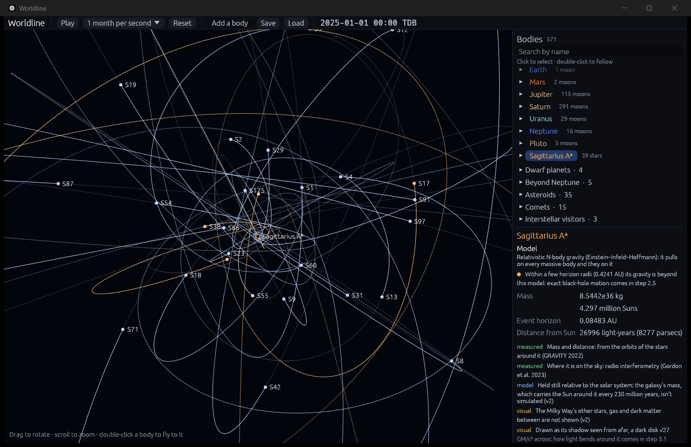
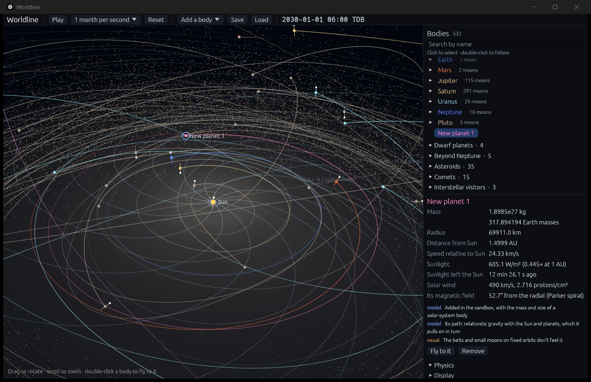
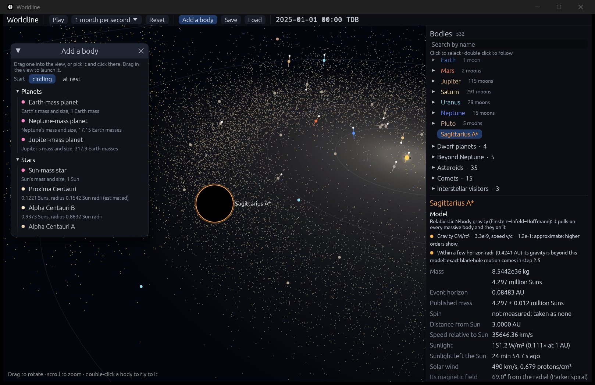

# The desktop app

**Code:** `crates/worldline-app/` · **Run:** `cargo run --release` (options: `-- --focus Jupiter --zoom 40 --paused --advance 7`; `--zoom` sets how many of the focused body's radii away the camera starts, and `--advance` runs the physics that many years past the 2025 snapshot before the window opens)

The app is a window around the physics engine. It never does physics itself. It asks `worldline-core` to advance the simulation, then draws the result.

## Each frame

1. **Measure real time.** It measures how much real time has passed since the last frame, capped at 0.1 s so a stall (like dragging the window) doesn't cause a jump.
2. **Advance the physics.** It advances by *speed × real time*. Each step runs the whole hierarchy: relativistic gravity for the Sun and planets, then each planet's moon system in its own frame (see [physics/moons.md](physics/moons.md)). These are the same models the validation tests check. After each step the app copies positions into one flat list of bodies: the Sun and planets in the snapshot's order, then the moons. A planet with moons stands in for its system's barycenter.
3. **Respect a time budget.** Physics may use at most 12 ms of each frame. If the chosen speed needs more, the simulation runs slower than requested and the top bar shows an orange note with the percentage achieved. **Worldline never takes bigger, less accurate steps to keep up.** Accuracy wins over speed, and the app says so when that happens.
4. **Point the camera.** The camera moves to the body it is following.
5. **Draw.** It draws the panels and the 3D view: rings and trails at the back, textured globes from the GPU in the middle, dots and labels in front. See [rendering.md](rendering.md).

## The 3D view

- **Projected in double precision.** Every position is taken relative to the camera in double precision, and only the final screen coordinates become single precision. GPUs work in single precision (about 7 digits), which can't place Neptune (4.5 × 10¹² m out) to better than about a kilometer. Projecting relative to the camera keeps positions precise at any zoom; a unit test nudges a body 30 AU out by 1 km and checks that it moves on screen by exactly the right amount.
- **Drawing.** egui's painter draws the shapes, rendering through wgpu: rings, trails, bodies and labels. The GPU ray tracer for black holes arrives in milestone 3.
- **To scale.** Distances and positions are true. Bodies are drawn at their true size when that's visible; otherwise as dots at least 3 points wide, and the app says so in the Display panel.
- **Camera.** It orbits a target, with "up" pointing to ecliptic north, so prograde orbits run counterclockwise seen from above. Drag rotates and scroll zooms, down to 1.1 radii from a body's center. Double-clicking a body (or pressing *Fly to it*) flies the camera there in 1.2 s, ending 4 radii out so the globe fills most of the view. The fly-in eases in and out, and zooms evenly in scale, so going from 4 AU to 25,000 km looks smooth.
- **Trails.** Each trail keeps about one orbit of path, measured as one circle's length at the body's distance from the barycenter, so Mercury and Neptune both show one loop. Trails are drawn in the barycentric frame, and they fade from old to new. A physics step can carry a body farther than the trail's point spacing (about half a degree of arc as seen from the barycenter), especially in the outer solar system. Then the points in between are filled in by cubic Hermite interpolation from the positions and velocities at both ends of the step. This only smooths the drawing; the physics never uses trails.
- **Moons.** A moon can circle its planet several times between physics steps (Phobos takes 7.7 hours), too fast for a recorded trail. So each moon shows its *osculating orbit* instead: the ellipse it would follow if only its planet pulled on it, computed from its current position and velocity. It fades toward the moon like a trail. Moons appear only around the planet in focus: the planet the camera follows, or the planet of the moon it follows. A selected moon shows too. Every other planet stays a single clean dot, so hundreds of moons' labels and orbits don't bury the view. Jupiter alone has 115 moons, spread over 0.2 AU. Even around the focused planet, a moon and its orbit appear only once the view resolves them: when its distance from its planet, on screen, clears the planet's dot or globe.
- **Names.** Zoomed out, hundreds of names would bury the view, so only these bodies are named:
  - the body the camera follows and the selected one;
  - the one under the pointer, which also gets a faint ring, and the cursor turns into a hand;
  - any body close enough to be drawn as a globe;
  - the major moons of the planet in focus, which appear only once the view resolves their orbits.

  A name is skipped if it would overlap one already placed. The Voyager crossing markers are named when the pointer is on them.
- **Spin axes.** Each body gets a line along its spin axis, from the IAU rotation models. A white dot marks the end the spin points toward (right-hand rule), so Venus's dot points down. The inspector shows each body's sidereal day, spin direction and axial tilt. See [physics/rotation.md](physics/rotation.md).
- **Details and their kind.** The inspector lists what's shown up close for the selected body, each tagged **measured** (observed data), **model** (a physics model) or **visual** (a visual aid or simplification). See [rendering.md](rendering.md).
- **Small moons and focus.** All 459 known moons are in the list. Flying to a planet, or to any of its moons, switches that planet's small moons to detailed simulation. Every other small moon rides an approximate orbit, and the inspector says which it is. A small moon shows its orbit only while selected, since hundreds of ellipses would hide everything else. A moon whose size hasn't been measured is drawn as a dot, and the camera flies to 1,000 km from it. See [physics/small-moons.md](physics/small-moons.md).
- **The side panel** has two parts, so its controls never scroll out of reach:
  - **The body list,** at the top, in its own scrolling frame (at most about 40% of the panel's height), with a search box above it. It is a tree:
    - each planet folds open to its moons, with the count beside its name;
    - the small moons fold once more;
    - collapsible groups hold the dwarf planets, the bodies beyond Neptune, the asteroids, the comets and the interstellar visitors.

    Typing in the search box shows a flat list of matching names. Picking a body in the 3D view opens its branch and scrolls the list to it.
  - **Below the list,** always in view: the selected body's details, then collapsible Physics and Display sections. The Display options explain themselves in tooltips.
- **The look.** A quiet dark theme (`theme.rs`), so the sky stays the brightest thing on screen. One soft blue accent marks the selection; labels in the inspector are muted so the values stand out.
- **Belts and dust.** The asteroid belt, Jupiter's Trojans and the Kuiper belt (28,331 real orbits) are drawn as tiny squares: tan, gold and ice blue. Their positions come from fixed ellipses, refreshed once per frame on all cores (about 3.4 ms of work in total). The zodiacal dust is a faint warm glow in its tilted plane, with brightness from the COBE model on a log scale. Both show only when the camera is more than 0.05 AU from what it looks at, so zoomed in on a planet they don't sprinkle false stars across the sky. Both can be switched off in the Display panel. See [physics/belts.md](physics/belts.md) and [physics/zodiacal-dust.md](physics/zodiacal-dust.md).
- **The Sun's reach.** With the Sun in focus, the solar wind's magnetic field is drawn as 12 Parker spiral lines that turn with the Sun. From outside the termination shock, the heliosphere's two boundaries appear as faint wireframes, with the four Voyager crossings marked. The distance rings are labeled in light-time as well as AU. For any selected body, the inspector shows its sunlight (W/m²), how long ago that light left the Sun's surface (including gravity's Shapiro delay), and the solar wind there: speed, density and field angle, or whether the body lies beyond the wind. See [physics/sun-reach.md](physics/sun-reach.md).
- **Magnetospheres.** With a magnetized planet in focus, its magnetopause appears as a wireframe. Its nose sits where the planet's dipole balances 2025's average solar wind, and it points into the wind as the moving planet meets it. Earth also shows its two radiation belts, traced along dipole field lines around its tilted magnetic axis. The inspector gives the planet's field, its tilt and source model, the magnetopause distance and, for Earth, the belts' extent; for Venus and Mars, it explains they have none. See [physics/magnetospheres.md](physics/magnetospheres.md).
- **Small bodies** are drawn as dots in a color for their kind: comets pale blue, interstellar visitors magenta, and the rest in shades of tan and gray-brown. The inspector says whether a body pulls on the planets or only follows them, and whether it feels outgassing or the Yarkovsky push. See [physics/small-bodies.md](physics/small-bodies.md). For a moon, the inspector gives its distance and speed relative to its planet, and its axial tilt relative to its orbit around the planet. The Physics panel names both gravity models: the one between the planets and the one inside moon systems.
- **Dates.** The top bar shows the simulation time as a calendar date in TDB, JPL's time scale, using Meeus's Julian Date algorithm.

## The galactic center

Sagittarius A\*, the Milky Way's central black hole, is in the body list with its 39 stars, at its real place: 8,277 pc away, in its true direction on the sky. Double-click it to fly there; the camera climbs out from the solar system and comes back in, framing the stars. The camera can zoom out to about 300 kpc, far enough to see both at once.
- **Its stars** are colored by type: young, hot ones blue-white, cool giants orange. They show, with their orbits, around Sagittarius A\* in focus, like a planet's moons.
- **The inspector** gives its distance in light-years and parsecs, and labels what's measured and what isn't simulated. The galaxy between (its stars, gas and dark matter) and the Sun's 230-million-year orbit around the center come in v2.
- **Dropped bodies:** anything dropped near it, from the catalogue, joins its region and feels it.

See [physics/galactic-center.md](physics/galactic-center.md).

## Sandbox tools

**Select and inspect.** Click a body to select it; the inspector shows what is known about it. Double-click it to fly to it.

**The catalogue.** **Add a body** in the top bar opens the catalogue: 27 entries in six groups, each with its mass and size. Hover over one to see where the real one is and where its values were published. The entries are:
- **Planets:** copies of Earth, Neptune and Jupiter.
- **Stars:** a Sun-mass copy, Proxima Centauri, Alpha Centauri A and B, and Sirius A.
- **White dwarfs:** Sirius B. The inspector shows Chandrasekhar's limit and the radius an ideal white dwarf of its mass has; one that grows in a merger shrinks to that radius, and one pushed past the limit explodes (see [physics/white-dwarfs.md](physics/white-dwarfs.md)).
- **Neutron stars:** the Hulse–Taylor pulsar and its companion, two NICER pulsars, and GW170817's pair. The inspector shows the heaviest a neutron star can be and the radius for its mass (SLy); one that grows takes that radius, and one pushed past the maximum collapses into a black hole (see [physics/neutron-stars.md](physics/neutron-stars.md)).
- **Black holes:** from Gaia BH1 (9.6 Suns) up to Sagittarius A\*, M87\* and TON 618 (66 billion Suns).
- **Binaries:** the Hulse–Taylor pair, together on its measured 7.75-hour orbit; GW170817's neutron stars and GW150914's black holes, on the circular orbits whose waves are at 20 Hz, about 3 minutes and under a second before they merge.

See [physics/compact-objects.md](physics/compact-objects.md).

**Add and drag-launch.** Drag an entry from the catalogue into the view, or pick it and then click or drag in the view. **Start: circling / at rest**, at the top of the catalogue, chooses whether it starts on a circular orbit around the body in focus or still relative to it, so that they fall together.
- **Where it goes.** Press in the view where it should go, on the plane through the body in focus, parallel to the ecliptic.
- **Click without dragging** to put it on a circular orbit around the body in focus, or around the Sun if the focus has no mass. The speed is √(G(M + m)/r) relative to that body, prograde in the ecliptic; for two bodies that orbit is exactly circular.
- **Drag** to launch it faster or slower. One circular speed is added for every quarter of the camera's distance dragged.
- **The preview.** While dragging, the app draws the orbit it would follow around that body if nothing else pulled, its speed, and whether it would escape.
- **What it joins.** New bodies join the Sun and planets at the top of the hierarchy, with relativistic gravity: they pull on everything and everything pulls on them. A close pair, like the Hulse–Taylor neutron stars, also loses energy to gravitational waves; the inspector shows how fast its period shrinks and when the two will merge, and **See and hear its gravitational waves** opens a window with the waveform an observer on Earth would record, played as sound (see [physics/post-newtonian.md](physics/post-newtonian.md)). Two black holes that spiral in merge into one, as numerical relativity says: the top bar reports what the merger radiated, and the inspector shows the final hole's spin, kick and ringdown tone (see [physics/mergers.md](physics/mergers.md)). The moon systems feel their tides, and the asteroids and comets that follow the top level feel their pull. The belts, the small moons on fixed orbits, the solar wind and the heliosphere don't respond to them; the inspector says so.
- **When you're done,** press **Done** or Esc.
- **From the command line:** `--add jupiter:1.5` drops a Jupiter-mass planet on a circular orbit 1.5 AU from the Sun before the window opens (also `earth:`, `sun:`, or any catalogue name, like `"Gaia BH1:3"`). `--catalogue` opens the catalogue at startup, and `--waves` opens the gravitational-wave window for the focused body's pair.
- **Near a black hole:** a body it holds circles at the hole's exact circular speed (see [physics/kerr.md](physics/kerr.md)); inside the innermost stable orbit (6 G(M + m)/c² without spin), where no circular orbit lasts, it starts at rest. Launches are capped at half the speed of light.
- **Heavier than what it circles:** the two circle their common center of mass, rather than the new body dragging the other away.
- **Around another body, from the command line:** `--add "TON 618:6600@Sagittarius A*"` puts it 6,600 AU from Sagittarius A\* instead of the Sun.

**Remove.** **Remove** in the inspector, or the Delete key, takes the selected body out.
- **A planet with moons** goes with them (the button says how many).
- **The Sun can't be removed:** everything is measured from it.
- **Moons can't be removed on their own yet.**

The camera keeps following its body; if that body was removed, it goes back to the Sun.

**Black holes** are drawn as their shadow, a dark disk √27 GM/c² across, with a thin ring so they show against the sky (a visual stand-in; the ray tracer is step 3.1). The inspector shows a catalogue object's published mass with its uncertainty, its radius or horizon and spin, how much gravity reddens light from its surface, where the real one is, and its source.

**What feels an added body.** Everything:
- **The big bodies:** the Sun, planets, dwarf planets, the heaviest asteroids, and the comets and asteroids followed one by one.
- **The major moons,** through its tides.
- **The belts' 28,331 bodies,** live particles since step 2.1b (see [physics/swarm.md](physics/swarm.md)).
- **Small moons,** once it could tear them away: freed small moons keep their names and appear in the body list.

A distant body pulls the whole solar system almost equally, so it falls together; only tides pull it apart. The top bar reports what is swallowed and what is torn away ("Gaia BH3 swallowed 412 belt bodies"). If something absorbs the Sun, sunlight, the solar wind and the heliosphere go with it, but the belts stay.

**Collisions.** Bodies that touch merge: momentum is kept and volumes add. The top bar reports it ("New planet 1 hit Earth at 11.2 km/s and merged"). If the body you were following or had selected was absorbed, the camera and inspector move to the survivor. A planet that is absorbed leaves its major moons orbiting the Sun. See [physics/collisions.md](physics/collisions.md).

**The model indicator.** At the top of the inspector, under the body's name, a **Model** section says which model computes it. It also gives how strong gravity is there (ε = GM/rc²) and how fast it moves (v/c), relative to what pulls on it hardest. A colored dot grades whether the model covers that: green within range, amber approximate, red beyond it. Amber notes flag approximate positions, and massive bodies inside a moon system.

**Saves** include every belt body and freed moon (about 4 MB). Saves from before step 2.1b load with the belts carried along fixed ellipses from the start.

**Save and load.** **Save** writes the whole state to `%APPDATA%\Worldline\saves`, named after the simulation's date. **Load** lists the saves, newest first.
- **What a save holds:** the moment, and every body's position and velocity: the Sun and planets, each moon system and the followers. It also records which bodies were removed or added.
- **What it doesn't need to hold:** gravity fields, rotation and the data behind each body come from the bundled data when it loads.
- **It's exact.** Numbers are written in their shortest exact form, so a save loads back bit for bit.
- **One limit:** small moons being computed in detail restart from their mean orbits.

**The physics check** (`cargo test --release -p worldline-data --test validation_sandbox -- --nocapture`). A Jupiter-mass planet is dropped on a circular orbit 1.5 AU from the Sun, between Earth and Mars. The solar system is then run for ten years, with and without it:
- **Energy and momentum are conserved:** 1.9 × 10⁻¹⁰ and 1.8 × 10⁻¹¹ relative change. Relativistic gravity only lets the Newtonian quantities wobble by about (v/c)² ≈ 4 × 10⁻⁸.
- **The disturbance has the expected size.** After a year, Earth is 6.4 million km from where it would be (relative to the Sun). That is 2.3 times the simplest estimate, ½ (Gm/AU²) t².
- **Mars's orbit shrinks** from 1.524 to 1.470 AU in ten years. **Venus's eccentricity rises** from 0.0067 to 0.0086.
- **The circular launch is circular:** the new planet stays between 1.49994 and 1.50016 AU through its first orbit.

## Tests

`cargo test -p worldline-app` covers:
- **Durations:** light travel times read as seconds, minutes and seconds, or hours and minutes.
- **Calendar:** known dates, including J2000, Sputnik 1 and the first Gregorian day, and rounding at midnight.
- **Camera:** projection geometry, hiding points behind the camera, size falling off with distance, double-precision stability 30 AU out, and the zoom limits.
- **Simulation loop:** one real second advances by exactly the chosen speed; pausing stops time; running out of budget is reported; trails reach back about one orbit and stay smooth across long steps; planets stand in for their systems' barycenters, with their moons listed under them; moons show only around the planet in focus; small moons are computed in detail only around the focus; every belt body lies between its orbit's perihelion and aphelion, and moves with time.
- **Picking:** clicking selects the nearest body within reach.
- **Sandbox:** added bodies join the simulation and run. Removing Jupiter takes its 115 moons with it while Saturn's keep their planet. The Sun and moons can't be removed. A save loads back to the same text, and two loads of one save run identically.
- **Picking a point:** a point picked on a plane projects back to the same pixel.
- **Names:** only the bodies attended to are named (followed, selected, pointed at, near enough to be a globe, or a major moon of the planet in focus).
- **Gravitational waves:** two neutron stars recorded from 190 Hz chirp to the end of their post-Newtonian inspiral, their strain growing as f^(2/3); the sound plays in real time with the wave's zero crossings, a slow pair is sped up into hearing, the chirp is flagged rough above 290 Hz for neutron stars (below 20 Hz for GW150914), and the WAV file is well formed. The catalogue's GW170817 pair starts with its wave at 20 Hz, to rounding. A black-hole pair's recording ends with the final hole's ringdown, at its tone.
- **Mergers:** GW150914's holes, started past where their radiation reaction converges, merge at once into a 63.03-Sun hole, and a save keeps how it formed.
