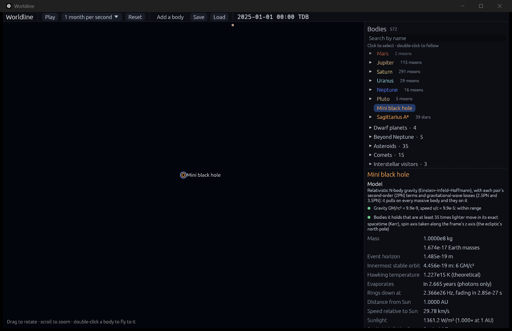

# Hawking evaporation

**Code:** `crates/worldline-core/src/hawking.rs` (the temperature, power, lifetime and exact mass loss), `crates/worldline-core/src/hierarchy.rs` (black holes losing mass, and vanishing, as time runs), `crates/worldline-app/src/catalogue.rs` (a hypothetical mini black hole)
**Tests:** `crates/worldline-core/tests/validation_hawking.rs`, plus unit tests in the code and the app
**Sources:**
- **Hawking radiation:** Hawking (1974), *Nature* 248, 30; Hawking (1975), *Commun. Math. Phys.* 43, 199.
- **What real black holes emit:** Page (1976), *Phys. Rev. D* 13, 198, as summarized by Carr, Kohri, Sendouda & Yokoyama (2010), *Phys. Rev. D* 81, 104019, section "Evaporation of primordial black holes: Lifetime".
- **The cosmic microwave background's temperature:** Fixsen (2009), *ApJ* 707, 916.

**Theoretical:** Hawking radiation has never been observed. The app says so.

## Why it matters

In 1974 Stephen Hawking showed that black holes aren't quite black. Quantum fields near a horizon make it glow like a hot body, at a temperature inversely proportional to its mass:

T = ħc³/(8πGMk_B).

For a black hole of the Sun's mass that is 60 billionths of a kelvin, far colder than the 2.7 K glow left from the Big Bang, so it absorbs more than it gives off. But a small black hole is hot. It loses mass, gets hotter, and loses mass faster, until it ends in a burst. Black holes this small could only have formed in the early universe ("primordial" black holes). None has been found, but whether any are ending their lives today is still searched for.

## The model

**The textbook estimate** (the roadmap's): a black body at the Hawking temperature, as big as the horizon (radius 2GM/c²), emitting photons. Stefan–Boltzmann's law, P = σT⁴ · 4π(2GM/c²)², gives

P = ħc⁶/(15360π G²M²),

and the mass it carries off, dM/dt = −P/c², makes M³ fall at a steady rate. So a hole of mass M lives

**t = 5120π G²M³/(ħc⁴)**: 2.7 years for 10⁸ kg, 2.1 × 10⁶⁷ years for the Sun's mass.

**In the simulation,** after every step each black hole hotter than the cosmic microwave background (2.725 K) loses exactly the mass it radiated: M(t + dt) = (M³ − 3ħc⁴ dt/(15360πG²))^(1/3). So its lifetime doesn't depend on step size.
- **Its horizon** shrinks with its mass.
- **Its velocity** doesn't change, since the radiation leaves evenly in all directions.
- **When the mass runs out,** the hole vanishes and the top bar says so.

Holes colder than the background absorb more than they radiate; that's every hole heavier than 4.5 × 10²² kg, 0.6 of the Moon's mass. They aren't evaporating today, and the inspector says so. What they gain from the background is negligible (about a tenth of a milligram a year for one of the Sun's mass) and isn't added.

**What the textbook estimate leaves out.** Real black holes emit, with greybody factors, every particle light enough for their temperature:
- **Heavier than 10¹⁴ kg:** photons, neutrinos and gravitons, 13.5 times faster than the textbook model (Carr et al. 2010, with f = 1).
- **Hotter, lighter holes:** electrons, muons, then quarks and gluons, up to about 200 times faster (f = 15.35).

So a primordial hole ending its life today weighs 5.1 × 10¹¹ kg by Carr et al., against 1.7 × 10¹¹ kg in the textbook model. The roadmap asks for the textbook model, which is the one with a closed form. The app labels it.

## In the app

**The catalogue** has a hypothetical **mini black hole**, labeled as such: 10⁸ kg (100,000 tonnes, smaller than a proton). It evaporates in 2.7 years, about half a minute at the default speed. It glows at 1.2 × 10¹⁵ K and 3.6 × 10¹⁶ W at first, growing hotter and brighter until it vanishes.

**For every black hole,** the inspector shows its Hawking temperature, labeled theoretical, and either when it evaporates, or that it is colder than the cosmic background and isn't evaporating today.

Run `cargo run --release -- --add "Mini black hole:1" --paused --advance 3` and the hole is gone from the list: the top bar says it "evaporated completely".

## Where it's valid

- **The textbook model:** photons only, no greybody factors. Real emission is 13.5 to about 200 times faster (above).
- **The last moments:** below the Planck mass (22 micrograms), Hawking's semiclassical picture fails, and what happens is unknown. The simulation lets the hole vanish.
- **No spin or charge:** a spinning hole radiates its spin first. A merger's remnant spins, but it is far too heavy to evaporate.

## Validation (`cargo test`)

`cargo test --release -p worldline-core --test validation_hawking -- --nocapture`:

| Check | Expected | Result |
|---|---|---|
| **Lifetimes** (the roadmap's) for 10⁸ kg, 10¹¹ kg, the Moon's mass and the Sun's | t = 5120π G²M³/(ħc⁴), and the same from radiating the mass away, ∫ c² dM/P(M), built independently from Stefan–Boltzmann's σ = π²k⁴/(60ħ³c²), the Hawking temperature and the horizon's area; to 10⁻¹² | agree to 10⁻¹²: 2.665 years, 2.665 billion years, 1.06 × 10⁴⁵ years, 2.10 × 10⁶⁷ years |
| σ from first principles | CODATA's 5.670374419 × 10⁻⁸ W/m²K⁴ | equal to 10⁻⁹ |
| A 10⁸ kg hole 1 AU from the Sun, in the hierarchy the app runs | shrinks as M₀(1 − t/τ)^(1/3); vanishes within one step of τ = 2.665 years | 1.8 × 10⁻¹⁵ off at mid-life; vanished 0.03 days after τ (steps of 1 day) |
| A hole of the Sun's mass | 6.17 × 10⁻⁸ K, the commonly quoted value; not evaporating today | 6.170 × 10⁻⁸ K; colder than the background |
| The textbook model against Carr et al.'s f = 1 rate | 13.5 times slower (the label's number) | 13.48 |
| Printed | the mass ending its life today; the mass as warm as the background | 1.7 × 10¹¹ kg (Carr et al.: 5.1 × 10¹¹); 4.5 × 10²² kg, 0.61 Moons |
| In the app: a 10⁶ kg hole, lifetime 84 s | at half its lifetime, (1/2)^(1/3) of its mass; then gone, and the top bar says so | 0.793701 (exact); gone |
