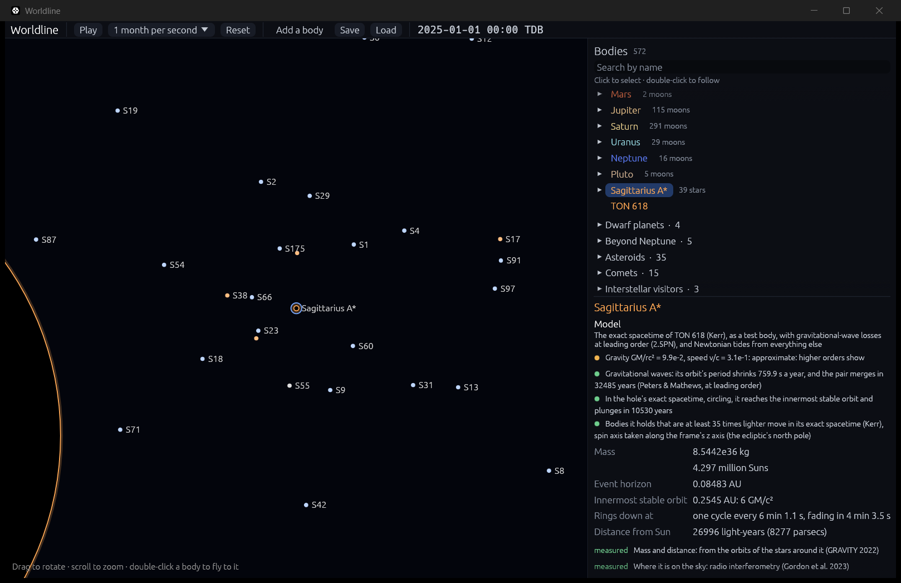

# Near a black hole: its exact spacetime (Kerr)

**Code:** `crates/worldline-core/src/gravity/kerr.rs` (the spacetime, the geodesic equation, circular orbits, the innermost stable orbit, the plunge time), `crates/worldline-core/src/gravity/relativistic.rs` (which bodies move in it, inside the N-body simulation)
**Tests:** `crates/worldline-core/tests/validation_kerr.rs`, `crates/worldline-data/tests/validation_emri.rs`, plus unit tests in both code files
**Sources:**
- **The spacetime:** Kerr (1963), *Phys. Rev. Lett.* 11, 237, in the Cartesian form of Kerr & Schild (1965), as given by Visser (2007), arXiv:0706.0622, section "Kerr–Schild Cartesian coordinates".
- **Circular orbits and the innermost stable one:** Bardeen, Press & Teukolsky (1972), *ApJ* 178, 347 (the innermost stable orbit: eq. 2.21).
- **The plunge:** Ori & Thorne (2000), *Phys. Rev. D* 62, 124022.
- **Radiation reaction:** the leading (2.5PN) term of Blanchet (2024), *Living Reviews in Relativity* 27, 4 (see [post-newtonian.md](post-newtonian.md)).

## Why it matters

Far from a black hole, gravity is nearly Newton's, and the post-Newtonian equations add relativity's corrections one order at a time. Close in, that series fails: near the innermost stable orbit the corrections are as large as the force. But a body much lighter than the hole moves almost exactly as a test body in the hole's spacetime, which general relativity gives in closed form: Kerr's solution, for a hole of any spin.

That spacetime has features no expansion captures. Closer than the **innermost stable circular orbit** no orbit lasts: the slightest nudge sends a body spiraling in. That is 6 GM/c² for a hole that doesn't spin. A spinning hole drags space around with it: orbits turning with it can go as deep as 1 GM/c², those against it no deeper than 9 GM/c². When a star or a smaller black hole spirals into a supermassive one, an *extreme-mass-ratio inspiral*, it circles down to that orbit, then plunges.

## The model

**The spacetime.** Kerr's metric in Kerr–Schild coordinates: g = η + f l⊗l, with
- f = 2Mr³/(r⁴ + a²z²);
- l = (1, (rx + ay)/(r² + a²), (ry − ax)/(r² + a²), z/r);
- M = GM/c², and a the spin times M, along +z;
- r, the Boyer–Lindquist radius, defined by (x² + y²)/(r² + a²) + z²/r² = 1.

These coordinates are Cartesian like the rest of the engine. Unlike the textbook (Boyer–Lindquist) ones they are smooth at the poles and through the horizon, so a body can orbit at any inclination and plunge in without the equations blowing up. Far away, f → 2GM/(rc²), and the motion becomes Newton's.

**The motion.** A free body follows a geodesic, d²xⁱ/dt² = −Γⁱ_αβ uᵅuᵝ + Γ⁰_αβ uᵅuᵝ dxⁱ/dt, with u = (1, v/c), which gives an acceleration like any other force and fits the engine's integrator. The Christoffel symbols Γ come from the metric's derivatives. Those are computed by automatic differentiation (dual numbers), so none is typed in by hand. Kerr–Schild's form makes the rest simple: the inverse metric is η − f l l, with no matrix to invert.

**Which bodies.** A body moves in a hole's spacetime when that black hole pulls on it hardest and the body is at least 35 times lighter (ν = mM/(m + M)² < 1/36). Everything else keeps the post-Newtonian N-body equations. The threshold comes from what each leaves out:
- As a test body, the body's own mass is ignored: relative order ν · GM/rc².
- The post-Newtonian equations stop at (GM/rc²)³, and their radiation reaction stops converging near GM/rc² ≈ 0.1.

At the innermost stable orbit, GM/rc² = 1/6, the deepest a body circles, the test-body error is the smaller exactly when ν < (1/6)².

**A held body's motion** is computed in the hole's frame:
- **The orbit:** the Kerr geodesic for the pair's total mass and the hole's spin. The spin is read from its horizon's size.
- **Losses to gravitational waves:** the leading (2.5PN) radiation reaction, which drains the orbit's energy at the quadrupole formula's rate. Its next correction diverges near the innermost orbit, so it is left out.
- **Every other body:** a Newtonian tide, its pull on the body minus its pull on the hole.
- **The hole's own motion,** as computed for the hole.

**Merging.** A held body circles down to the innermost stable orbit, plunges, and merges when it reaches the horizon. Mass and momentum are kept. The post-Newtonian merger rule (where their reaction stops converging) doesn't apply to it.

**The plunge time.** On a circular orbit around a hole that doesn't spin, losing energy at that rate, the orbit shrinks at

dr/dt = −(64/5) ν c (GM/rc²)³ (1 − 2GM/rc²)/(1 − 6GM/rc²).

This is the radiated power, (32/5) ν² (c⁵/G)(GM/rc²)⁵, set against how a circular orbit's energy changes with its radius in the hole's spacetime, E = (1 − 2GM/rc²)/√(1 − 3GM/rc²). The 1 − 6GM/rc² is the innermost stable orbit announcing itself: there the rate runs away, and the orbit plunges. Integrated, the time to the plunge is

(5/64ν)(GM/c³)[F(x) − F(6)], with F(x) = x⁴/4 − 4x³/3 − 4x² − 16x − 32 ln(x − 2) and x = rc²/GM.

Far out it becomes Peters' formula; close in it is much shorter.

**Labeled assumptions:**
- **The spin axis isn't in the catalog,** so it is taken along the simulation's z axis, the ecliptic's north pole. (The catalog's holes mostly have no measured spin; TON 618's isn't measured, so it doesn't spin here.)
- **Kerr–Schild coordinates and time** are used near the hole, and post-Newtonian (harmonic) ones elsewhere. They differ at first order in GM/rc², so a body moving between the two descriptions jumps by that much. It only does so where it changes which body pulls it hardest, far from the hole, where GM/rc² is tiny.
- **The losses** are the leading-order ones: near the innermost orbit, general relativity's power differs by tens of percent.

## In the app

**For a held body,** the inspector's model reads, for example: "The exact spacetime of TON 618 (Kerr), as a test body, with gravitational-wave losses at leading order (2.5PN), and Newtonian tides from everything else". It is graded by what that leaves out, ν · max(GM/rc², v²/c²). When the hole doesn't spin, a line gives when the body reaches the innermost stable orbit and plunges, next to Peters' leading-order merger time.

**For every black hole,** the inspector gives its innermost stable orbit: "0.2545 AU: 6 GM/c²" for Sagittarius A\*, or the orbits with and against the spin for a spinning hole.

**Launching a body around a black hole** (click to circle) uses the hole's exact circular speed, Ω = 1/(r^(3/2) + a) in units of GM/c² and c. Without spin that is Newton's √(G(M + m)/r) exactly. Inside the innermost stable orbit, a body starts at rest and falls in.

**Something heavier than what it circles** takes that body around their common center of mass rather than dragging it away.

To watch Sagittarius A\* spiral into TON 618, ten times TON 618's GM/c² out:

`cargo run --release -- --add "TON 618:6600@Sagittarius A*" --focus "Sagittarius A*" --paused --waves`

## Where it's valid

- **The orbit:** exact for a test body. What's left out is the body's own mass, ν · GM/rc²: 6 × 10⁻⁶ for Sagittarius A\* around TON 618 at the innermost orbit.
- **The losses:** leading order; near the innermost orbit, general relativity's power differs by tens of percent.
- **The tides of other bodies:** Newtonian; they matter only far from the hole.
- **The plunge time:** for circular orbits around holes that don't spin.
- **Not modeled:** the hole's spin changing as it swallows a body, and the spacetime of two comparable holes (which is the post-Newtonian equations' and numerical relativity's domain; see [mergers.md](mergers.md)).

## Validation (`cargo test`)

`cargo test --release -p worldline-core --test validation_kerr -- --nocapture` and `cargo test --release -p worldline-data --test validation_emri -- --nocapture`:

| Check | Expected | Result |
|---|---|---|
| **The innermost stable orbit of a hole that doesn't spin** (the roadmap's): circular orbits, nudged by 10⁻⁶, just outside and just inside | 6 GM/c²: 0.5% outside they keep circling, 0.5% inside they plunge. (The nudge swings an orbit by about 10⁻⁶/ε at a fraction ε outside; inside, it grows by e every 1/(2π√ε) turns.) | at 6.030 GM/c², kept circling between 6.027 and 6.030 for 300 turns; at 5.970, plunged |
| The same for spin 0.9, with the spin and against it | Bardeen, Press & Teukolsky: 2.3209 and 8.7174 GM/c² | kept circling at 2.3325 and 8.7609; plunged at 2.3093 and 8.6738 |
| A bound, eccentric, inclined orbit around a hole spinning at 0.9 (between 8.0 and 12.4 GM/c²), 20 orbits | keeps its energy and its angular momentum about the spin axis to the integrator's precision, 10⁻⁹ | 3.3 × 10⁻¹⁶ and 7.8 × 10⁻¹⁶ |
| Circular orbits (spin 0 at 10 GM/c²; spin 0.9 with it at 4, against it at 12) | back where they started after 10 turns of 2π(r^(3/2) ± a) | within 10⁻¹³ |
| Far away (10⁶ GM/c²) | Newton's pull, to the corrections' order GM/rc² = 10⁻⁶; passes below √(GM/rc²) | to 2.0 × 10⁻⁶ |
| A star held by a 40-Sun hole, 1 AU out, with a third star's tide | the hole's acceleration plus its Kerr orbit, radiation reaction and the tide; and the post-Newtonian equations' value to their first order (GM/rc² = 4 × 10⁻⁷), passing below √(GM/rc²) | as built, to rounding; within 1.3 × 10⁻⁶ |
| **Sagittarius A\* spirals into TON 618** (ν = 6.5 × 10⁻⁵, GM/c³ = 3.77 days) from a circular orbit at 9 GM/c², in the hierarchy the app runs: the time from 8.5 to 6.5 GM/c² | the adiabatic rate above: 2.91114 × 10⁵ GM/c³. Up to corrections of order ν; a mistake would show at order 1; passes below √ν = 8 × 10⁻³ | **2.91125 × 10⁵ GM/c³ (3,002 years), 3.8 × 10⁻⁵ off** |
| Its plunge, from the innermost stable orbit to the horizon | about ν^(−1/5) = 7 orbits there (Ori & Thorne); a stable orbit would take about ν^(−1); passes below the midpoint, ν^(−3/5) = 320 | 4.4 orbits (4.2 years); 3,895 orbits and 4,792 years in all |
| The plunge time far out (10⁴ GM/c²) | Peters' formula, to the first correction, −16/(3x) = −5.3 × 10⁻⁴ | 0.999467 of it |
