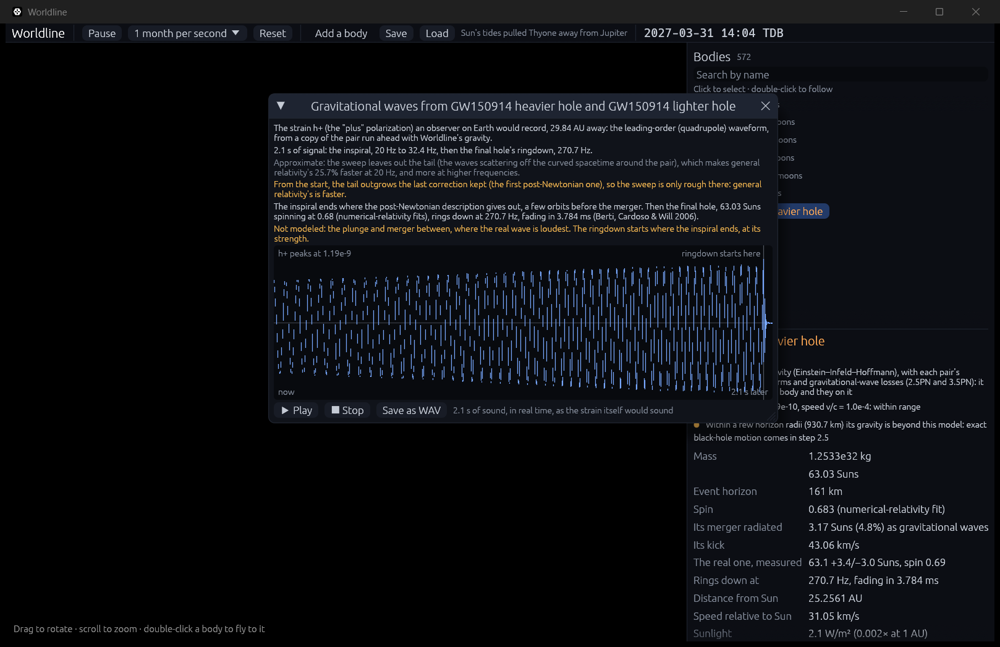

# Black-hole mergers: numerical-relativity fits

**Code:** `crates/worldline-core/src/merger.rs` (the fits and the merger), `crates/worldline-core/src/gravity/post_newtonian.rs` (`center_of_mass`, `circular_pair`), `crates/worldline-core/src/hierarchy.rs` (when a pair merges), `crates/worldline-app/src/waves.rs` (the ringdown in the recorded wave)
**Tests:** `crates/worldline-data/tests/validation_gw150914.rs`, plus unit tests in the code files
**Sources:**
- **Final mass and spin:** Jiménez-Forteza, Keitel, Husa, Hannam, Khan & Pürrer (2017), *Phys. Rev. D* 95, 064024 (arXiv:1611.00332, the "UIB2016" fits LIGO uses). Their fits without spins, calibrated to 92 non-spinning simulations; coefficients at the precision of the paper's supplementary material.
- **Kick:** González, Sperhake, Brügmann, Hannam & Husa (2007), *Phys. Rev. Lett.* 98, 091101, a fit to 30 simulations in the form Fitchett (1983) derived.
- **Ringdown:** Berti, Cardoso & Will (2006), *Phys. Rev. D* 73, 064030, Table VIII: fits to the exactly computed quasi-normal modes of spinning (Kerr) black holes.
- **Center of mass:** Blanchet (2024), *Living Reviews in Relativity* 27, 4, section "Equations of motion in the frame of the center of mass".
- **Checks:** Scheel et al. (2009), *Phys. Rev. D* 79, 024003 (the most accurate equal-mass simulation); LIGO/Virgo, Abbott et al. (2016), *Phys. Rev. Lett.* 116, 061102 (GW150914's discovery) and GWTC-1, Abbott et al. (2019), *Phys. Rev. X* 9, 031040.

## Why it matters

On 14 September 2015 LIGO heard two black holes of about 36 and 29 Suns spiral together and merge 1.3 billion light-years away. In the last fraction of a second they turned three Suns' worth of mass into gravitational waves, and left one black hole of 62 Suns spinning at two-thirds of the fastest a black hole can. No formula describes those last moments, where gravity is as strong as it gets. Supercomputers solve Einstein's equations for them, and fits to hundreds of such simulations give what is left.

## The model

Two black holes spiral in under Worldline's post-Newtonian gravity (see [post-newtonian.md](post-newtonian.md)). Near GM/rc² ≈ 0.11, a few orbits before the real merger, the post-Newtonian series stops converging and the pair merges. If both are black holes, circling each other rather than plunging, the fits decide what forms:

- **Mass radiated** as gravitational waves, as a fraction of the total: E = (1 − 2√2/3) ν + 0.561 ν² − 0.847 ν³ + 3.145 ν⁴, with ν = m₁m₂/(m₁ + m₂)². The first term is exact. A small body spiraling into a big hole radiates the binding energy of the last stable circular orbit, 5.7% of its mass, before it plunges.
- **The final hole's spin:** a = (2√3 ν + 5.24 a₂ν² + 1.3 a₃ν³)/(1 + 2.88 a₅ν), with a₂ = 3.833, a₃ = −9.49, a₅ = 2.513. Its first term is the angular momentum of that last stable orbit, which the small body carries in. Equal masses leave a = 0.686.
- **The kick:** v = A ν² √(1 − 4ν) (1 + Bν), with A = 12,000 km/s and B = −0.93. When the masses differ, the waves carry more momentum one way than the other, and the hole recoils. Equal masses give no kick, by symmetry; the largest, 175 km/s, comes at a mass ratio of 0.36.
- **The ringdown:** the final hole rings like a struck bell, at its fundamental quasi-normal frequency, G M ω/c³ = 1.5251 − 1.1568 (1 − a)^0.1292, fading with quality factor Q = 0.7000 + 1.4187 (1 − a)^−0.4990 (it rings for about Q cycles). GW150914's final hole rings at 271 Hz and fades in 3.8 ms.

**What happens in the simulation.** The two holes are replaced by one:
- **Mass:** the pair's, less what the waves carried off.
- **Spin:** stored in its horizon's size, r₊ = GM/c² (1 + √(1 − a²)), which the inspector reads back.
- **Position and velocity:** the pair's center of mass and its motion, plus the kick.

The waves carry off the rest of the momentum: their mass's share of the pair's motion, and the kick's opposite.

**The center of mass, to second order.** At GM/rc² ≈ 0.1 the plain mass-weighted center isn't the pair's true center: relativity shifts it by ν Δ 𝒫 v, where Δ = (m₁ − m₂)/(m₁ + m₂) and 𝒫 ~ (GM/rc²)². For GW150914's holes that is tens of km/s, as large as the kick. Worldline uses Blanchet's relation through second post-Newtonian order, both when it places a pair on its orbit (`circular_pair`) and when it merges one (`center_of_mass`). What's left is third order, as a unit test checks.

**Three assumptions, labeled in the app:**
- **The fits are for holes that don't spin.** The spins of merging holes aren't tracked (only their size), so they are left out. For GW150914, LIGO measured spins consistent with zero.
- **The fits are for near-circular inspirals.** Spiraling in leaves nearly every pair circular: near the merger the radial speed is about 1% of the circling speed. Black holes that are falling together faster than they circle when they meet (a head-on plunge) radiate far less. They merge as any colliding bodies do (see [collisions.md](collisions.md)): mass and momentum kept.
- **The kick's direction isn't modeled.** It lies in the orbital plane, but where within it depends on the orbit's phase at the merger, which isn't simulated. It is taken along the heavier hole's motion.

**Neutron stars** that spiral in merge where the post-Newtonian description ends too, keeping their mass. Whether they leave a heavier neutron star or a black hole depends on nuclear matter, which comes in step 2.7.

## In the app

The top bar reports a merger, for example: "GW150914 lighter hole and GW150914 heavier hole merged into one black hole: 3.17 Suns radiated as gravitational waves; it spins at 0.68 and recoils at 43.1 km/s".

The final hole keeps the heavier one's name. The inspector shows for it:
- its spin;
- the mass its merger radiated;
- its kick;
- for a real event's pair, the hole that was measured: "63.1 +3.4/−3.0 Suns, spin 0.69" for GW150914.

For every black hole, the inspector also shows the tone it rings with: "Rings down at 270.7 Hz, fading in 3.78 ms". For Sagittarius A\* (spin not measured, taken as none) that is one cycle every 6 minutes.

**The waves window** (see [post-newtonian.md](post-newtonian.md)) ends a black-hole pair's recording with the final hole's ringdown, marked on the plot, and plays it. The plunge and merger between, where the real wave is loudest, aren't modeled: the ringdown starts where the inspiral ends, at its strength and phase. The window says so in amber.

To see GW150914 merge: `cargo run --release -- --add "GW150914 pair:30" --focus "GW150914 heavier hole" --paused --waves`. The waves window shows the chirp and the ringdown. Press Play in the top bar: the pair is 2 simulated seconds from merging, but its orbit forces the whole solar system into sub-millisecond steps, so they take 15 to 50 seconds to compute ("physics running at 0% of the requested speed"). Then the two holes are one, and time runs at full speed again.

## Where it's valid

- **Non-spinning holes on near-circular orbits:** the fits' own range. Their root-mean-square errors are 4.1 × 10⁻⁵ in radiated mass and 9.4 × 10⁻⁵ in spin, over mass ratios up to 18; at more extreme ratios they follow the exact small-body limits.
- **The kick:** González et al. estimate their errors at under 6%.
- **The ringdown:** the fit's largest error over spins 0 to 0.99 is 1.85% in frequency and 0.88% in quality factor. Only the fundamental mode is kept; overtones and higher harmonics fade faster or are weaker.
- **The merger happens a few orbits early,** where the post-Newtonian description ends: for GW150914, at 32 Hz rather than the real ~150 Hz peak. What it leaves is the same, since the fits give the end state from the start of the inspiral.
- **The final hole's motion** is uncertain by the center of mass's third-order wander: 18 km/s for GW150914, against its 43 km/s kick.

## Validation (`cargo test`)

`cargo test --release -p worldline-data --test validation_gw150914 -- --nocapture` and `cargo test --release -p worldline-core merger center_of_mass -- --nocapture`:

| Check | Expected | Result |
|---|---|---|
| **GW150914 replayed:** the catalog's holes (35.6 and 30.6 Suns) from a 20 Hz wave, spiraling in under Worldline's gravity | LIGO's 2016 measurement: 62 ± 4 Suns, spin 0.67 +0.05/−0.07, 3.0 ± 0.5 Suns radiated (90% credible); the roadmap: about 62 Suns, spin about 0.67 | **63.03 Suns, spin 0.683, 3.17 Suns radiated.** They merged 2.04 s after 20 Hz, at 32.4 Hz (GM/rc² = 0.110) |
| The same against GWTC-1 | 63.1 +3.4/−3.0 Suns, spin 0.69 +0.05/−0.04 | within both |
| Its kick and ringdown | (printed) | 43.1 km/s; 271 Hz, fading in 3.78 ms |
| Equal masses against the most accurate simulation (Scheel et al. 2009): M_f/M = 0.95162, spin 0.68646 | within the fits' root-mean-square errors, 4.14 × 10⁻⁵ and 9.41 × 10⁻⁵ | 0.951584 (3.6 × 10⁻⁵ off), 0.686370 (9.0 × 10⁻⁵ off) |
| A small body falling in (ν = 10⁻⁶) | radiates 1 − √(8/9) = 0.057191 of its mass and brings √12 = 3.464102 in spin, to the next order (twice its coefficient times ν) | 0.0571915 ν, 3.4640966 ν |
| The largest kick | 175.2 ± 11 km/s at ν = 0.195 ± 0.005 (González et al.) | 175.2 km/s at ν = 0.1951 |
| Ringdown fit against the exactly computed modes (Berti et al., Table II), spins 0 to 0.98 | within the fit's largest error, plus the table's rounding | worst: frequency 1.45% and quality factor 0.92% off, both at spin 0 (allowed 1.86% and 0.95%) |
| The center of mass, to second order, over 5 orbits (30 and 10 Suns) at GM/rc² = 0.003 and 0.01 | still at third order: its swing grows faster than (GM/rc²)³; the mass-weighted center's swing grows as (GM/rc²)^2.5 | as (GM/rc²)^3.52 (1.0 → 70 m/s); mass-weighted as (GM/rc²)^2.55 (43 → 913 m/s) |
| Black holes plunging head-on instead of circling | merge keeping mass, without the fits | as expected |

The app's tests (`cargo test -p worldline-app`) check:
- GW150914's holes, started past where their reaction converges, merge at the next step into a 63.03-Sun hole, and a save keeps how it formed.
- A recording of their waves ends with a ringdown at 270.7 Hz: 20 zero crossings in its 37.9 ms (20.5 expected). It joins the inspiral without a jump.
