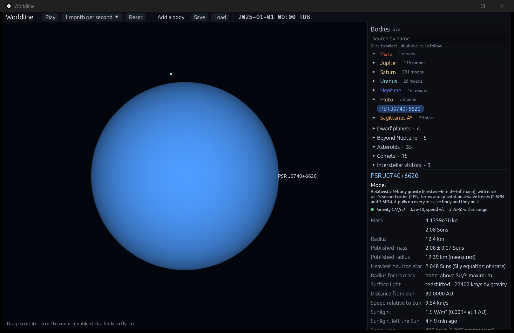

# Neutron stars: equations of state, maximum mass and collapse

**Code:** `crates/worldline-core/src/neutron_star.rs` (piecewise-polytrope equations of state, the Tolman–Oppenheimer–Volkoff equations, the maximum mass, the prompt-collapse threshold), `crates/worldline-app/src/simulation.rs` (neutron stars that grow, and collapse)
**Tests:** `crates/worldline-data/tests/validation_neutron_stars.rs`, plus unit tests in both code files
**Sources:**
- **Static stars in general relativity:** Tolman (1939), *Phys. Rev.* 55, 364; Oppenheimer & Volkoff (1939), *Phys. Rev.* 55, 374; in the enthalpy form of Lindblom (1992), *ApJ* 398, 569.
- **The equation of state:** SLy, Douchin & Haensel (2001), *A&A* 380, 151, as the piecewise polytrope of Read, Lackey, Owen & Friedman (2009), *Phys. Rev. D* 79, 124032 (Tables II and III).
- **Prompt collapse:** Bauswein, Baumgarte & Janka (2013), *Phys. Rev. Lett.* 111, 131101.
- **Measured neutron stars:** PSR J0740+6620, Fonseca et al. (2021) (mass) and Riley et al. (2021) (radius); PSR J0030+0451, Riley et al. (2019) (NICER).

## Why it matters

A neutron star packs more than the Sun's mass into a ball about 20 km across: matter denser than an atomic nucleus, held up by the pressure of neutrons and nuclear forces. Nobody knows exactly how such matter behaves, its *equation of state*. But each candidate predicts how big a neutron star of each mass is and how heavy one can get, so measuring neutron stars tests nuclear physics.

Past the maximum mass, gravity wins and the star collapses into a black hole. When two neutron stars merge, their total is usually above that maximum. If it is high enough, the remnant collapses at once (*prompt collapse*). If not, a hot, rapidly spinning star survives for a while, until it loses its spin and heat. That decides what is seen: GW170817's merger in 2017 lit up as a bright kilonova, more than a prompt collapse, which flings out little matter, could have made.

## The model

**The equation of state** is SLy, a widely used model consistent with the heaviest measured neutron stars, in Read et al.'s piecewise-polytrope form. On each density interval the pressure is p = K ρ^Γ, ρ being the rest-mass density. The energy density ε = (1 + a)ρc² + p/(Γ − 1) follows from the first law of thermodynamics, with the constants a set so it is continuous.
- **The crust,** below nuclear density: four pieces (Read et al.'s Table II).
- **The core,** above: three pieces with Γ = 3.005, 2.988 and 2.851, joined at 10^14.7 and 10^15 g/cm³, with log p = 34.384 (dyne/cm²) at the first (Table III).

Two notes from reading the paper closely:
- **Units:** Read et al.'s crust constants give p/c² in g/cm³, as their footnote says, not the pressure itself.
- **Joints:** at the crust densities they print, their rounded pieces' pressures differ by up to 1.2 × 10⁻⁴. The joints are recomputed where the pressures agree, as their definition requires (within 2 × 10⁻⁴ of the printed densities).

**The star** obeys the Tolman–Oppenheimer–Volkoff equations, general relativity's hydrostatic equilibrium. They are written with the log of the specific enthalpy, η = ln((ε + p)/(ρc²)), as the variable (Lindblom 1992):

dr/dη = −r (r − 2Gm/c²)/(Gm/c² + 4πG r³ p/c⁴), dm/dη = 4π r² (ε/c²) dr/dη.

η runs from its central value down to exactly 0 at the surface, so there is no surface to search for. The equations are integrated by fourth-order Runge–Kutta, with steps halved until each is accurate to 10⁻¹², breaking at each kink of the equation of state.

**The maximum mass** is the peak of mass against central density, found by golden-section search. Denser stars are unstable. SLy's heaviest is **2.048 Suns**, 9.98 km across in radius, with a central density of 2.0 × 10¹⁸ kg/m³. A 1.4-Sun star is 11.71 km.

**The prompt-collapse threshold** (Bauswein et al. 2013, from merger simulations with 12 equations of state): M_thres = k M_max, with k = −3.606 GM_max/(c² R₁.₆) + 2.380, where R₁.₆ is the radius of a 1.6-Sun star. For SLy: R₁.₆ = 11.55 km, so M_thres = **2.94 Suns**.

## In the app

**For a neutron star,** the inspector shows the heaviest a neutron star can be (2.048 Suns, SLy) and the radius SLy gives a star of its mass. For PSR J0740+6620, measured at 2.08 ± 0.07 Suns, it says that is heavier than SLy allows, within its uncertainty.

**A neutron star that grows** in a merger takes SLy's radius for its new mass: the Hulse–Taylor pulsar, after swallowing a Jupiter, is 11.68 km.

**Past the maximum it collapses into a black hole.** Its horizon replaces its surface, and its mass is kept. The top bar says which way:
- **Prompt:** two neutron stars above the threshold "collapsed at once into a black hole".
- **Delayed:** below the threshold but above the maximum, as for GW170817's pair (2.73 Suns): "they form a hot, spinning neutron star that collapses into a black hole as its spin and heat run down (shown at once)".
- **Accretion:** a neutron star that swallows something and passes the maximum "collapsed into a black hole".

From then on it is a black hole: its color, its details and the inspector say so.

**Labeled:**
- **One model among several:** SLy is one equation of state among several consistent with the measurements; another would move every number here by up to a few tenths of a Sun or a km or two.
- **Not modeled:** the matter a merger flings out (a few hundredths of a Sun), the remnant's spin, and the delay before a delayed collapse (milliseconds to longer).

## Where it's valid

- **Static, non-rotating, cold stars.** Uniform spin can hold up about a fifth more mass, which is what keeps some merger remnants alive for a while; heat matters only just after a merger.
- **SLy is soft compared with NICER's radius for PSR J0740+6620.** NICER measured 12.39 +1.30/−0.98 km, while SLy's heaviest star is 9.98 km. A stiffer equation of state would fit it better; SLy still holds up its mass within the uncertainty.
- **The threshold fit** misses its own simulations' k by up to 0.025 (about 0.05 Suns), and those simulations bracket each threshold to ±0.05 Suns.

## Validation (`cargo test`)

`cargo test --release -p worldline-data --test validation_neutron_stars -- --nocapture` and `cargo test --release -p worldline-core neutron_star -- --nocapture`:

| Check | Expected | Result |
|---|---|---|
| **SLy's heaviest neutron star** (the roadmap's) | about 2.05 Suns | **2.0484 Suns** (9.975 km, central density 2.0 × 10¹⁸ kg/m³) |
| SLy against Read et al. (2009, Table III): the fit's maximum mass and 1.4-Sun radius | 2.049 × 1.0002 Suns and 11.736 × 0.9979 km; they used the `rns` code's own G and Sun's mass, older than today's by up to 10⁻³, so 0.2% is allowed | 2.0484 and 11.706: both 0.05% below |
| A star of constant density (exact: Schwarzschild 1916) at GM/Rc² = 0.019, 0.14 and 0.27 | central pressure ρc²(1 − √(1 − 2u))/(3√(1 − 2u) − 1) and mass (4π/3)ρR³, to the integration's precision (10⁻⁹ allowed) | within 1.6 × 10⁻¹² and 3.5 × 10⁻¹³ |
| The equation of state is continuous | pressure and energy density at every joint, to 10⁻⁹ | yes |
| PSR J0740+6620, 2.08 ± 0.07 Suns: SLy must hold it up within its uncertainty | maximum ≥ 2.01 Suns | 2.048 |
| PSR J0030+0451, 1.34 Suns, 12.71 +1.14/−1.19 km (NICER) | SLy's radius at that mass within the range | 11.74 km |
| Bauswein et al.'s fit against their 12 equations of state | misses their k = M_thres/M_max by at most their stated 0.025 (plus their table's rounding) | at most 0.024 |
| SLy's threshold, and GW170817 (2.73 Suns in all) | above GW170817's mass: no prompt collapse, as its kilonova showed | 2.94 Suns: no prompt collapse |
| In the app: the Hulse–Taylor pulsar swallows a Jupiter; GW170817's stars merge | SLy's radius for 1.439 Suns; a delayed collapse into a black hole | 11.68 km; collapsed, now a black hole |
