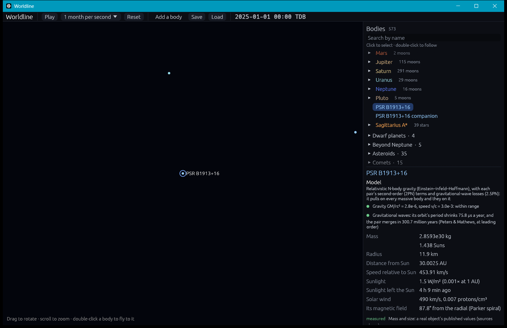
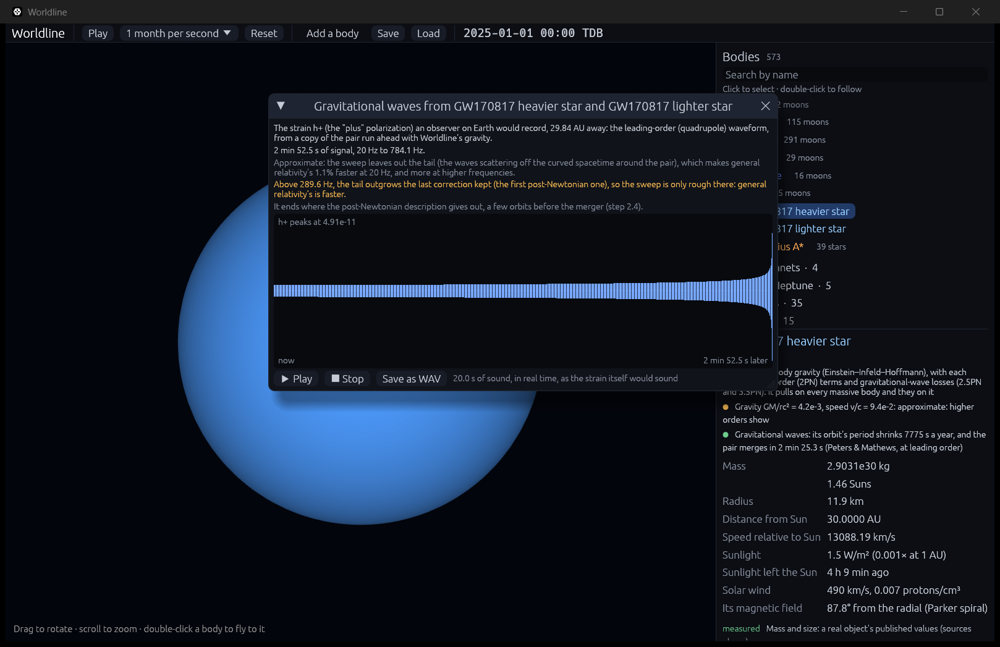

# Compact binaries: post-Newtonian orbits, gravitational waves and the chirp (2PN, 2.5PN and 3.5PN)

**Code:** `crates/worldline-core/src/gravity/post_newtonian.rs` (the gravity model), `crates/worldline-core/src/gravitational_waves.rs` (radiated power, how fast an orbit shrinks, time to merge, the strain an observer records), `crates/worldline-app/src/waves.rs` (recording a pair's waves, and their sound)
**Data:** `crates/worldline-data/data/binary-orbits.csv`: the Hulse–Taylor orbit and its measured and predicted period derivative, written by `tools/write_notable_objects.py`
**Tests:** `crates/worldline-data/tests/validation_gravitational_waves.rs`, `crates/worldline-core/tests/validation_chirp.rs`, plus unit tests in the code files
**Sources:**
- **Equations of motion:** Blanchet (2024), *Living Reviews in Relativity* 27, 4, sections "The 3.5PN acceleration and 3PN energy" and "Equations of motion in the frame of the center of mass", copied from the paper's own LaTeX. The 2PN terms are cross-checked against Kidder (1995), *Phys. Rev. D* 52, 821. Blanchet gives the 3.5PN terms in this general-frame form after Nissanke & Blanchet (2005), *Class. Quantum Grav.* 22, 1007.
- **Pairwise terms in N-body codes:** Kupi, Amaro-Seoane & Spurzem (2006), *MNRAS* 371, L45; Mikkola & Merritt (2008), *AJ* 135, 2398.
- **Orbit decay and merger time:** Peters & Mathews (1963), *Phys. Rev.* 131, 435; Peters (1964), *Phys. Rev.* 136, B1224.
- **The radiated power's first correction:** Wagoner & Will (1976), *ApJ* 210, 764, as given by Kidder (1995), section "Energy Loss".
- **The chirp and the waveform:** Blanchet (2024): section "The quadrupole moment formalism" for the waveform, and its energy and flux for circular orbits for the sweep's corrections.
- **The measurements:** Weisberg & Huang (2016), *ApJ* 829, 55 (Hulse–Taylor); LIGO/Virgo GWTC-1, Abbott et al. (2019), *Phys. Rev. X* 9, 031040 (GW170817's and GW150914's masses).

## Why it matters

In 1974 Russell Hulse and Joseph Taylor found a pulsar orbiting an unseen neutron star every 7.75 hours. Timing its pulses over decades showed the orbit shrinking: the period loses 76 microseconds a year. General relativity predicts exactly that loss from the energy the pair radiates as gravitational waves. It was the first evidence that gravitational waves exist (Nobel Prize 1993), twenty years before LIGO heard two black holes merge.

In its last minutes a pair like that sweeps up through the band LIGO hears: the **chirp**. The wave's frequency is twice the orbit's, and it rises faster and faster as the orbit shrinks. On 17 August 2017 LIGO and Virgo followed two neutron stars (GW170817) for about 100 seconds before they merged. How fast the frequency sweeps up is set by one combination of the masses, the chirp mass, which is how such signals are weighed.

## The model

Worldline's top-level gravity is the Einstein–Infeld–Hoffmann equations, first post-Newtonian order (1PN), for every body (see [einstein-infeld-hoffmann.md](einstein-infeld-hoffmann.md)). On top of that, each pair of bodies gets two more terms of the two-body equations of motion, in harmonic coordinates, in any frame:
- **Second order (2PN):** conservative corrections of relative size (GM/rc²)². For two neutron stars 100 km apart that is about 10⁻³ of Newton's pull; for the Sun and Mercury, 10⁻¹⁵, below double precision.
- **Radiation reaction (2.5PN):** the pull that drains the pair's energy into gravitational waves, of relative size ν (GM/rc²)^(5/2), where ν = m₁m₂/(m₁+m₂)². It is the first term with an odd power of 1/c, which is why it is not conservative: it changes sign if time runs backwards. It takes energy out of the orbit exactly as fast as Einstein's quadrupole formula says the waves carry it off.
- **The radiation reaction's first correction (3.5PN),** GM/rc² of it (since step 2.3). It makes the drain match the waves' power to the next order, the quadrupole formula's first correction (Wagoner & Will 1976). The chirp needs it: without it the sweep's first correction, −(743/336 + 11ν/4) GM/rc², comes out wrong, and step 2.3's check fails by a factor of 10.

**Left out: 3PN.** The conservative third-order terms change the sweep at order (GM/rc²)³, two orders after the 3.5PN terms, which change it at order GM/rc². At 20 Hz for neutron stars that is 10⁻⁶ against 10⁻² (before their coefficients), far below anything checked here.

**Typos in the published 3.5PN terms.** Blanchet (2014, 2024) and Nissanke & Blanchet (2005) print four of the G⁴m⁴ terms over r⁶. Their units need r⁵, as the others have, and only r⁵ agrees with the center-of-mass equations, which a unit test compares them with.

**Pairwise, as N-body codes do it.** The pair terms are exact for two bodies. With more, the 2PN terms that couple three bodies are left out. They matter only when a third body sits close to a compact pair. Adding two-body post-Newtonian terms to N-body gravity is how N-body codes treat compact binaries (Kupi et al. 2006; Mikkola & Merritt 2008).

**Nothing changes for the solar system.** The new terms are below double precision there, so every solar-system check gives the same numbers as with the first-order equations alone.

**Formulas for what the waves do,** from the orbit as it is now (`gravitational_waves.rs`):
- **Radiated power,** Einstein's quadrupole formula for two point masses: F = (8/15) G³ m₁² m₂² (12 v² − 11 ṙ²) / (c⁵ r⁴), with ṙ the radial speed.
- **How fast the period shrinks,** averaged over an orbit (Peters & Mathews 1963): dP/dt = −(192π/5c⁵) (2πG/P)^(5/3) m₁m₂ (m₁+m₂)^(−1/3) f(e). The eccentricity factor f(e) = (1 + 73e²/24 + 37e⁴/96)/(1 − e²)^(7/2) is about 12 for the Hulse–Taylor binary: most of the power goes out near periastron.
- **Time until the pair merges** (Peters 1964): the period and eccentricity shrink together along a curve Peters found in closed form. The time is an integral along it, computed by Simpson's rule. For a circular orbit it reduces to (3/8) P/|dP/dt|.

## The chirp

**The waveform** (`strain` in `gravitational_waves.rs`) is Einstein's quadrupole formula: an observer a distance R away sees the strain h_ij = (2G/c⁴R) d²I_ij/dt², where I_ij = Σ m xᵢxⱼ is the pair's mass distribution about its center, projected across the line of sight. The two polarizations, h₊ and h×, are its parts along two axes across the line of sight and along their diagonals. Face-on, the two are equally strong and a quarter cycle apart; edge-on, h× vanishes and h₊ is half as strong. A unit test checks all three.

**The sweep.** For a circular orbit, the energy lost to waves and the orbital energy together give how fast the wave's frequency f rises:

df/dt = (96/5) π^(8/3) (G𝓜/c³)^(5/3) f^(11/3) [1 − (743/336 + 11ν/4) x + 4π x^(3/2) + …]

where G𝓜 = (Gm₁ Gm₂)^(3/5)/(Gm)^(1/5) is the chirp mass and x = (πGmf/c³)^(2/3) ≈ GM/rc². The first correction comes from the 1PN energy and the 3.5PN radiation reaction. The face-on amplitude is h = 4 (G𝓜)^(5/3) (πf)^(2/3)/(c⁴R).

**What the simulation can't carry: the tail.** The +4π x^(3/2) term comes from waves scattering off the curved spacetime around the pair on their way out. It depends on the pair's whole past, so no equations of motion that look only at the present carry it. Worldline's chirp is therefore slower than general relativity's by about 4π x^(3/2): 1.1% at 20 Hz for GW170817's stars, and more at higher frequencies. The app says so.

**Where the simulated chirp turns rough.** Once the term left out, the tail, outgrows the last one kept, the first correction, the series no longer describes the sweep. That happens at x = [(743/336 + 11ν/4)/(4π)]² ≈ 0.053, which is 290 Hz for GW170817's stars but 12 Hz for GW150914's black holes, 25 times heavier (`rough_above` in `waves.rs`). From there the app warns in amber that the sweep is only rough and that general relativity's is faster. GW150914 shows why: from 20 Hz the simulated pair takes 2 s to reach 32 Hz, where the real one went from 35 Hz to its merger in about 0.2 s (Abbott et al. 2016, *Phys. Rev. Lett.* 116, 061102).

**Where the post-Newtonian description ends.** For a circular orbit the 3.5PN correction is about −9 GM/rc² times the 2.5PN term, so it overtakes it near GM/rc² ≈ 0.11. Past there the truncated series no longer converges; run on, its equations can pump the orbit eccentric or even fling the pair apart, which is wrong. Worldline watches for it (`reaction_converges`):
- **Recording the waves** stops there, or at the innermost stable orbit of a test body, x = 1/6, if that comes first.
- **In the simulation,** a bound pair whose reaction stops converging (with GM/rc² above 0.01) merges, unless the lighter is a test body in a black hole's exact spacetime (at least 35 times lighter; see [kerr.md](kerr.md)), which circles down to the innermost stable orbit and plunges instead. Two black holes circling each other merge as numerical relativity's fits say, a few percent of their mass going into waves (see [mergers.md](mergers.md)); anything else the way touching bodies do, mass and momentum kept.

## In the app

The inspector's model line says the top level includes the 2PN and gravitational-wave terms. Its validity grade now allows for second order:
- **Within range** while what's left out, max(GM/rc², v²/c²)³, is below IAS15's 10⁻⁹ tolerance, i.e. GM/rc² under 10⁻³.
- **Approximate** while it stays under 1%, i.e. GM/rc² under 0.2.
- **Beyond** past that.

For a body in a bound pair that will merge within the age of the universe (13.787 billion years; Planck 2020), the inspector adds a line. For the Hulse–Taylor pair, dropped from the catalogue: "its orbit's period shrinks 75.8 µs a year, and the pair merges in 300.7 million years".

To see it: `cargo run --release -- --add "PSR B1913+16 pair:30" --focus "PSR B1913+16" --zoom 100000 --paused`.

**Seeing and hearing the waves.** For a pair that will merge, the inspector offers **See and hear its gravitational waves**. It runs a copy of the pair ahead, on its own, with the same gravity, and records the strain h₊ an observer on Earth would see, 64 times an orbit, for up to 3000 orbits or until the post-Newtonian description ends. The window plots it, gives its span and frequencies, and labels the approximations (the tail, and where the sweep turns rough):
- **Play** turns it into sound. If its frequencies are already in the range we hear well, 20 Hz to 4 kHz, it plays in real time: that is what the strain itself would sound like. Otherwise it is sped up (or slowed) so its highest frequency sounds at 400 Hz. The last 20 seconds at most are kept.
- **Save as WAV** writes the sound to `worldline-gravitational-waves.wav` in the current folder.
- **The catalogue's GW170817 and GW150914 pairs** start on a circular orbit whose wave is at 20 Hz, already falling in at the leading-order rate so that the orbit stays circular. Relativity slows an orbit of a given size, by about (3 − ν)/2 GM/rc² (1.2% for GW170817), so the separation is solved for together with the relativistic circular speed until the wave is at exactly 20 Hz.

To hear GW170817: `cargo run --release -- --add "GW170817 pair:30" --focus "GW170817 heavier star" --paused --waves`.

## Where it's valid

- **Weak fields:** what's left out is of third order (3PN), (GM/rc²)³, and the radiation reaction's second correction (4.5PN), (GM/rc²)² of it.
- **The Hulse–Taylor binary** barely notices step 2.3's 3.5PN terms: they change the period's shrink by about 10⁻⁵ of itself, a hundred times below the measurement's uncertainty.
- **The chirp** lacks the tail (above), and its waveform is the leading-order one: its amplitude is right to GM/rc², 0.4% at 20 Hz for neutron stars.
- **The observer** is assumed many wavelengths away (a wavelength is 15,000 km at 20 Hz): only there does the strain fall as 1/R.
- **The last orbits and the merger itself** need numerical relativity: Worldline takes what they leave from its fits (see [mergers.md](mergers.md)), but doesn't simulate them.
- **Spins are not part of the motion.** They tilt the orbit's plane and turn the stars' axes, but drain no energy, so they don't change how fast the period shrinks.
- **Waiting for a merger in the app** isn't practical yet. The Hulse–Taylor pair turns every 7.75 hours, so 300 million years is 340 billion orbits, each computed step by step. The inspector gives the time instead.

## Validation (`cargo test`)

`cargo test --release -p worldline-data --test validation_gravitational_waves -- --nocapture` and `cargo test --release -p worldline-core post_newtonian -- --nocapture`:

| Check | Expected | Result |
|---|---|---|
| Two bodies in their center-of-mass frame: the general-frame equations (EIH plus the pair terms) against the center-of-mass equations, GM/rc² = 10⁻³ | equal up to third order. A 2PN mistake would show at (GM/rc²)², so the test passes below (GM/rc²)^(5/2) = 3.2 × 10⁻⁸ of Newton's pull | 3.4 × 10⁻¹¹ (3:1 masses), 2 × 10⁻¹⁶ (equal masses) |
| The same for the radiation reaction, isolated by flipping the velocities (it changes sign, the rest doesn't): its 3.5PN part | equal up to the next order; a mistake would show at the part's own size, so the test passes below √(GM/rc²) = 3.2% of it | 9.7 × 10⁻⁶ (3:1), 7 × 10⁻⁸ (equal masses); skipped near a test particle, where the 3.5PN part is 10⁻¹⁶ of the pull, at rounding |
| An eccentric pair (e = 0.5, GM/rc² = 10⁻³ at periastron) without radiation reaction keeps its 2PN energy over 10 orbits | wanders GM/rc² times less than with first order alone; the test passes below √(GM/rc²) times as much | 9.3 × 10⁻⁹ against 2.4 × 10⁻⁵ (bound 7.5 × 10⁻⁷) |
| With radiation reaction, an eccentric pair (e = 0.5) over 20 orbits, ending at a periastron: the energy lost against the quadrupole formula and its first correction | equal up to second order; the test allows √(GM/rc²) times the miss of the formula alone | at GM/rc² = 10⁻²: 6.6 × 10⁻⁴ (bound 5.2 × 10⁻³; the formula alone misses by 5.2%); at 3 × 10⁻³: 6.0 × 10⁻⁵ (bound 8.5 × 10⁻⁴; alone 1.6%). Both about 6.7 (GM/rc²)²: second order |
| The radiation reaction converges (its 3.5PN part smaller than its 2.5PN part), circular orbits | yes at GM/rc² = 0.01 and 0.08, no at 0.14 (they cross near 0.11) | as expected |
| Two neutron stars at GM/rc² = 0.05 spiral in | they merge once the reaction stops converging, and are never flung apart | merged after 0.328 s, never farther apart than they started (80 km); mass kept |
| The Hulse–Taylor binary, 1000 orbits: its period's shrink against Peters & Mathews' formula, same masses and orbit | within √(GM/rc²) = 2.4 × 10⁻³ | 4.7 × 10⁻⁵ apart |
| Against general relativity's prediction from the measured masses, −2.40263(5) × 10⁻¹² (Weisberg & Huang 2016) | within 8.5 × 10⁻⁴, what rounding the catalog's masses to 0.001 Suns allows | **−2.40221 × 10⁻¹²**, 1.7 × 10⁻⁴ apart |
| The roadmap | −2.40 × 10⁻¹² s/s | −2.40221 × 10⁻¹² |
| Against the measurement, corrected for the galaxy's pull: −2.398(4) × 10⁻¹² | (printed) | 1.1σ, as general relativity's own prediction is |
| The same pair without radiation reaction | the period holds, to better than the precision demanded above | drifts 6.3 × 10⁻¹⁷ (bound 2.0 × 10⁻¹⁵) |
| Time to merge, a circular orbit | Peters' closed form (5/256) c⁵a⁴/(G³m₁m₂m), to 10⁻¹² | matches |

### The chirp (step 2.3)

`cargo test --release -p worldline-core --test validation_chirp -- --nocapture`. Two neutron stars of 1.4 and 1.3 Suns start on a circular orbit whose wave is near 20 Hz and spiral in to 40 Hz: 3,927 wave cycles in 152.1 s. An observer 40 Mpc away, face-on, records h₊ 64 times an orbit. As one would from a detector's data, the frequency is read off the wave's zero crossings, and a parabola through 400 half-cycles gives f and df/dt at five points:

| f (Hz) | x | df/dt measured (Hz/s) | chirp formula: miss (bound √x) | with its 1PN term: miss (bound x) | general relativity, with the tail | amplitude miss (bound √x) |
|---|---|---|---|---|---|---|
| 19.976 | 0.0089 | 0.04321 | 0.04445: 2.8% = 3.2 x (9.4%) | 0.04331: 0.24% = 30 x² (0.89%) | 0.04378 | 0.39% |
| 22.304 | 0.0095 | 0.06459 | 0.06660: 3.0% (9.8%) | 0.06476: 0.27% (0.95%) | 0.06554 | 0.42% |
| 25.524 | 0.0104 | 0.10557 | 0.10920: 3.3% (10%) | 0.10590: 0.31% (1.0%) | 0.10736 | 0.46% |
| 30.357 | 0.0117 | 0.19851 | 0.20623: 3.7% (11%) | 0.19923: 0.36% (1.2%) | 0.20252 | 0.52% |
| 38.708 | 0.0138 | 0.48058 | 0.50271: 4.4% (12%) | 0.48264: 0.43% = 22 x² (1.4%) | 0.49285 | 0.60% |

What it shows:
- **The chirp formula holds to its next order:** the measured sweep is 3.2 x slower than it, at every frequency.
- **With its 1PN term,** what's left is second order, 22 to 30 x². Without the 3.5PN reaction terms the sweep instead runs 6.7 x fast (measured at 20 Hz), missing the 1PN formula by ten times this bound.
- **General relativity's chirp, with the tail,** is about 1% faster than the simulated one, as expected (above).
- **The amplitude** matches 4 (G𝓜)^(5/3) (πf)^(2/3)/(c⁴R) to its next order.

The app's recording is checked too (`cargo test -p worldline-app waves -- --nocapture`): two neutron stars chirp from 190 Hz to 793 Hz in 0.6 s and stop at the end of the post-Newtonian inspiral. Their strain grows as f^(2/3), within x = 0.10, and the sound, played in real time, crosses zero as often as the wave. A pair a million kilometers apart is sped up a million times into hearing.

### The orbit's shrink

**How the shrink is measured.** As pulsar astronomers do: the simulation records the moment of every periastron passage, found by Newton's method on r·v, and a parabola through the 1000 times gives the period's rate of change. By the last passage the shrinking has added up to a delay of 34 ms.

**Matching the measured orbit.** An orbit started from Kepler's laws comes out slightly different under relativity: its period 1.5 × 10⁻⁴ longer, its eccentricity 3.6 × 10⁻⁵ larger. The eccentricity matters here because f(e) is steep: left unmatched, it moves the result by 3.2 × 10⁻⁴. So the test adjusts the starting orbit until the simulated period and eccentricity (from the distances at periastron and apastron) are the measured ones.

**The bounds.** Each comes from the theory's own orders, not from guesses. Where a correct result is of one order (say (GM/rc²)³) and a mistake would be of the order before ((GM/rc²)²), the test passes below the geometric midpoint between them. The prediction is compared within what rounding the catalog's masses allows, and the roadmap's number to the digits it gives.
