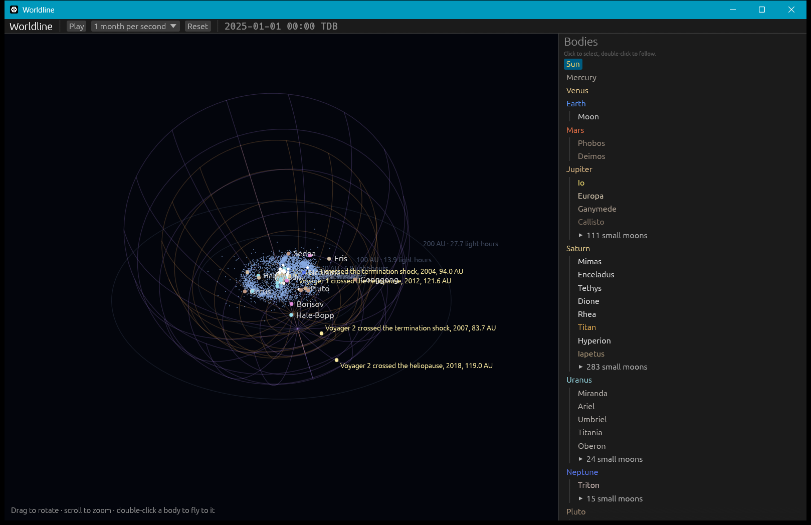

# The Sun's reach: sunlight, light travel time, the solar wind and the heliosphere

**Code:** `crates/worldline-core/src/sunlight.rs`, `crates/worldline-core/src/solar_wind.rs`, `crates/worldline-data/src/heliosphere.rs`, `crates/worldline-app/src/view.rs` (drawing) and `app.rs` (inspector)
**Data:** `crates/worldline-data/data/solar-wind-2025.csv`, `voyager-crossings.csv` · **Fetch scripts:** `tools/fetch_solar_wind.py`, `tools/fetch_heliosphere.py`
**Tests:** `crates/worldline-data/tests/validation_sun_reach.rs`, plus unit tests in the core

## Sunlight

**Model:** the Sun's luminosity spread over a sphere, F = L / 4πr², with the IAU's nominal L = 3.828 × 10²⁶ W (IAU 2015 Resolution B3).

| Check | Expected | Worldline |
|---|---|---|
| Sunlight at 1 AU | 1360.8 ± 0.5 W/m², measured by NASA's SORCE satellite at the 2008 solar minimum (Kopp & Lean 2011, *GRL* 38, L01706) | 1361.17 W/m² |
| Average over 2025, at the simulated Earth | the roadmap's 1361 W/m² | 1361.3 W/m² |
| Brightest and faintest days of 2025 | at perihelion (early January) and aphelion (early July), 6.9% apart | 1407.7 W/m² on 5 January, 1317.0 W/m² on 4 July |

**The IAU's luminosity is not an independent number.** It is defined as 4π (1 AU)² × 1361 W/m², rounded to four digits. So the real check is the comparison with SORCE's measurement, which it passes within the measurement's ±0.5 W/m².

**The yearly average is a little above 1361** because Earth's orbit is slightly eccentric: the average of 1/r² over an ellipse is 1/(a²√(1 − e²)).

**Not modeled:** the Sun's own brightness varies by about 0.1% over its 11-year cycle.

The inspector shows the sunlight at any selected body, in W/m² and relative to 1 AU.

## Light travel time

How long sunlight takes to arrive is the distance over c, plus one relativistic correction:
- **The Shapiro delay** (Shapiro 1964, *PRL* 13, 789): gravity slows light passing a mass, by Δt = (2GM/c³) ln((r₁ + r₂ + d)/(r₁ + r₂ − d)).
- **Sunlight on its way to Earth** is delayed 52.7 µs by the Sun's own gravity.
- **Light grazing the Sun** between Earth and Mars is delayed 123.5 µs each way, about 250 µs round trip. That is the effect the Viking landers measured in 1976–77.

| Check | Expected | Worldline |
|---|---|---|
| 1 AU / c | 499.004 783 836 s (IAU τ_A, from the exact AU and c) | 499.004 783 836 s |
| Average over 2025, Sun to the simulated Earth | the roadmap's 8.3 min | 8.318 min |
| 1 January 2025, from the Sun's surface | | 488.377 s, of which 52.7 µs is gravity's delay |

**Testing the formula.** A unit test integrates the delay's definition, (2GM/c³) ∫ ds/r, along a path grazing the Sun and matches the closed form.

**In the app.** The inspector shows how long ago the selected body's sunlight left the Sun's surface. The distance rings are labeled in light-time too: 1 AU is 8.3 light-minutes, 50 AU is 6.9 light-hours.

## The solar wind and the Parker spiral

**Model.** Parker (1958, *ApJ* 128, 664) predicted that the Sun's corona blows outward as a supersonic wind, carrying the Sun's magnetic field with it:
- **Why it spirals.** The Sun turns beneath the outflow, so each field line winds into an Archimedean spiral, like the water from a turning garden sprinkler.
- **The angle.** The field meets the radial direction at tan ψ = Ω r sin θ / v, where Ω is the Sun's sidereal rotation rate and θ is the colatitude from its spin axis.
- **Inputs:**
  - Ω comes from the Sun's IAU rotation model (25.38 days).
  - The wind speed v and density come from **2025's measured average at Earth: 490 km/s and 6.1 protons/cm³**.
  - The density falls as 1/r², as the wind spreads.
  - Field lines start at the "source surface", 2.5 solar radii out (Altschuler & Newkirk 1969; Schatten et al. 1969).

**Validation against a year of measurements.** NASA's OMNI dataset (King & Papitashvili 2005) merges the solar wind measured upstream of Earth by ACE, Wind and DSCOVR. Worldline compares Parker's prediction with all 8,760 hours of 2025:
- **The field is two-way.** It points outward along the spiral in some regions and inward in others: those are the magnetic sectors. So the measured direction, atan2(B_y, −B_x) in GSE coordinates, is treated as an axis, and opposite directions count as one.
- **Prediction.** Each hour, Parker predicts the angle from that hour's measured speed.
- **Day by day.** Consecutive hours aren't independent, so the comparison is made day by day. The year's average daily difference must be within 3 standard errors of zero.

| | Spiral angle at Earth |
|---|---|
| Measured (axis of all 2025 hours) | 44.3° |
| Parker, from each hour's measured speed | 41.9° |
| Average daily difference | +2.0° ± 1.2° (standard error): within 3σ |
| The model's spiral with 2025's average speed | 41.2° at 1 AU |

The roadmap expected the spiral to cross 1 AU "at about 45°", and the measured field does: 44.3°. The textbook 45° assumes a 400 km/s wind; 2025's wind was faster (490 km/s), which makes the spiral less tightly wound.

**Where the spiral comes from.** The OMNI data came through the French CDPP's AMDA service, which serves the same OMNI dataset through the standard HAPI protocol. NASA's own servers couldn't be reached from the development machine. AMDA's catalog record names the field "b_gse".

**In the app.** With the Sun in focus, 12 field lines are drawn in the Sun's equatorial plane, tilted 7.25° to the ecliptic. They turn with the Sun and fade out by 10 AU, where they have wound round about one and a half times. The inspector shows the wind's speed, density and field angle at the selected body.

**Not modeled:**
- **Sector polarity.** Polarity is set by the Sun's changing magnetic field, so the lines are drawn without it.
- **Fast streams, slow streams and solar storms.** The wind is one steady average.
- **Latitude.** The real wind is faster above the Sun's poles at solar minimum.

## The heliosphere's boundaries

The solar wind blows a bubble in the interstellar gas:
- at the **termination shock**, it drops abruptly from supersonic to subsonic;
- at the **heliopause**, it meets the interstellar gas.

Only Voyager 1 and 2 have crossed them:

| Crossing | Published | JPL Horizons, noon that day | Source |
|---|---|---|---|
| Voyager 1, termination shock | 16 Dec 2004, 94.01 AU | 94.028 AU | Stone et al. 2005, *Science* 309, 2017 |
| Voyager 2, termination shock | 31 Aug 2007, 83.7 AU | 83.673 AU | Stone et al. 2008, *Nature* 454, 71 |
| Voyager 1, heliopause | 25 Aug 2012, 121.6 AU | 121.607 AU | Stone et al. 2013, *Science* 341, 150 |
| Voyager 2, heliopause | 5 Nov 2018, 119.0 AU | 119.022 AU | Stone et al. 2019, *Nature Astronomy* 3, 1013 |

**The cross-check.** The test requires each Horizons position to be within 0.05 AU of the published distance, half the tenth of an AU three of them are quoted to. Voyager 1's termination shock differs by 0.018 AU, about two days of its travel. That is more than its two quoted decimals suggest; the cause isn't known.

**The shape between the points is a model,** labeled as such in the app:
- **Orientation.** The nose points where the interstellar wind comes from: ecliptic longitude 255.8°, latitude 5.16°, measured by IBEX from interstellar helium (Bzowski et al. 2015, *ApJS* 220, 28).
- **Shape.** The simplest flow model, a source blowing into a uniform stream, gives a **Rankine half-body**, r(θ) = r₀ √(2/(1 + cos θ)). A unit test checks it is the surface the flow never crosses.
- **Size.** Each boundary's nose distance is fitted through its two crossings, giving a termination shock at 83.3 AU and a heliopause at 112.0 AU.

**How well the shape fits.** The fit misses the crossings by ±9% (termination shock) and ±5% (heliopause). That is the cost of a symmetric shape: the real heliosphere is squeezed by the interstellar magnetic field, which pushed the termination shock 10 AU closer where Voyager 2 crossed it, in the south. The tail has never been measured. The app draws the shape only out to 120° from the nose.

**In the app.** Both boundaries are drawn as faint wireframes, with the Voyager crossings marked, whenever the camera is outside the termination shock. From inside, they would surround it. The inspector says whether the selected body is in the supersonic wind, in the heliosheath between the boundaries, or in interstellar space.
