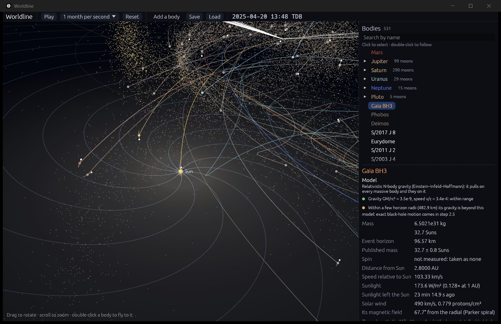

# The swarm: every small body feels every massive one

**Code:** `crates/worldline-core/src/swarm.rs` (the integrator), `crates/worldline-core/src/kepler.rs` (exact two-body drifts), `crates/worldline-core/src/hierarchy.rs` (recording the planets' paths, freeing small moons), `crates/worldline-data/src/belts.rs` (`belt_particles`, the belts' starting states)
**Data:** `crates/worldline-data/data/belt-samples.csv`, from `tools/fetch_belt_samples.py`
**Tests:** `crates/worldline-core/tests/validation_swarm.rs`, `crates/worldline-data/tests/validation_belts.rs`, plus unit tests

## What's in it

The swarm holds the massless bodies too many to integrate one by one:
- **The belts:** the 28,331 asteroids, Jupiter Trojans and Kuiper belt objects of [belts.md](belts.md).
- **Freed small moons:** any small moon torn from its planet (below).

They pull on nothing, but they feel every massive body: the Sun, planets, heaviest asteroids, and anything added in the sandbox. A black hole dropped near the belt scatters it, swallows what reaches its horizon, and captures the rest into a cloud of its own.

## How they move

Each particle takes **Wisdom–Holman** steps (Wisdom & Holman 1991, *AJ* 102, 1528), the scheme planetary scientists use for test particles, generalized to whatever dominates each particle:

**1. The center.** Each particle is followed around one body, its center:
- among the bodies it is bound to (its two-body energy relative to them negative), the one with the smallest Hill sphere containing it;
- else the bound body pulling hardest;
- else the body pulling hardest.

Normally that's the Sun; inside a planet's Hill sphere, the planet; near a black hole that has captured it, the black hole. A body racing past never becomes the center of what it doesn't capture.

**2. Drift.** The particle is carried exactly along its two-body orbit around the center for the whole step, by Kepler's equation in universal variables (Danby 1988; Battin 1999). This works for ellipses, parabolas and hyperbolas alike. The drift also reports the closest approach to the center, so a particle whose orbit dips inside the center's surface or horizon during the step is swallowed.

**3. Kicks.** Before and after each drift, half a step's worth of every other body's pull. Each body counts twice: its pull on the particle, minus its pull on the center (the particle is followed in the center's frame, which those bodies accelerate).

**Step length.** Steps are at most 64 days, and shorter when two error estimates call for it:
- **Splitting** (Wisdom & Holman): the error per step is the kicks' strength relative to the center's pull, ε, times the square of the step over the particle's orbital period P. So dt ≤ P √(10⁻⁵/ε).
- **Sampling:** each kick changes in a time τ (the time to cross its distance at the relative speed, or its dynamical time √(d³/GM)). Sampled every dt, a kick of strength a misses about a τ (dt/τ)² of velocity; that must stay within 10⁻⁵ of the particle's orbital speed.

A kick too weak to matter over its whole time needs no limit. The Sun's wobble from Mercury, felt by everything around the Sun, is one. So in the solar system almost every particle takes 64-day steps. A black hole passing at a tenth of the speed of light shortens the steps of the asteroids near it to seconds, and no others.

**Following the planets.** The planets' paths come from the main simulation's own steps: their positions, velocities and accelerations at both ends of each step, interpolated between. The swarm runs up to 64 days behind and catches up in its own steps, so it doesn't step every time the planets do. When drawn, each particle is carried the rest of the way to the present on its two-body orbit.

**Cost.** About 30 ms per 64-day step for all 28,331, shared among all cores. A simulated year with the belts live takes 2.6 s instead of 2.4 s.

## Where the belts start

JPL gives the belts' orbits at its own epoch, 2026-06-09, 524 days after the snapshot (2025-01-01). Carried back on fixed ellipses, they would start off by the planets' pull over those days. Instead:
1. The Sun, planets and heaviest asteroids are run forward to that epoch, recording their paths.
2. The 28,331 bodies are run back along those paths to the snapshot with the same scheme, which runs equally well backward.

This takes about 0.4 s at startup. The few dozen bodies whose orbits JPL gives at other epochs are carried back on their ellipses.

## Small moons torn from their planets

Small moons around a planet not in focus ride their mean orbits, which already include the Sun's pull. When another body comes close enough to tear one away, it is freed: it becomes a swarm particle, keeps its name, and appears in the body list.
- **When:** its tide on the moon (how differently it pulls on the moon and the planet) passes 1/12 of the planet's pull, the threshold that, for a distant body, lies at half the planet's Hill radius (Domingos, Winter & Yokoyama 2006).
- **What's not counted:** the body the planet itself orbits (the Sun), whose pull the mean orbits include.
- **A shortcut:** a body can only tear a moon if twice its pull at the gap between it and the farthest moon beats that threshold, so the full test runs only then.

When a planet's major moons are torn away, or the planet is absorbed (see [collisions.md](collisions.md)), all its small moons are freed with them.

## Validation (`cargo test`)

`cargo test --release -p worldline-core --test validation_swarm -- --nocapture`:
- **A black hole streaking past.** A hole of 10 Suns crosses 3 AU from the Sun at a tenth of the speed of light, past a ring of 72 asteroids 2.5 AU out. Each asteroid's kick, relative to the Sun, must match the impulse approximation: 2GM/(bV) toward the hole's path, times Z/√(Z² + b²) for a path from −Z to +Z, minus the Sun's own kick (Binney & Tremaine 2008, §8.2).
  - **Allowed:** what that approximation leaves out is how far the asteroid moves while kicked, its speed over the hole's, 6.3 × 10⁻⁴; twice that is allowed.
  - **Result:** kicks up to 993 m/s, all within **9.1 × 10⁻⁴** of the prediction.
- **A black hole in the ring.** A hole of a million Suns dropped among the asteroids swallows all 72 within 30 days, and none is lost any other way.

`cargo test --release -p worldline-data --test validation_belts -- --nocapture`, against JPL Horizons for 24 bodies spread through the belts (12 main belt, 6 Trojans, 6 Kuiper belt):

| Check | Live swarm | Fixed ellipses (before) |
|---|---|---|
| Where they start, 2025-01-01, run back from JPL's 2026 orbits | median 3.8 × 10⁻⁶, worst 2.1 × 10⁻⁵ of their distance | median 3.4 × 10⁻⁴, worst 2.4 × 10⁻³ |
| Where they are a Julian year later, started from JPL's 2025 states | median 2.3 × 10⁻⁶, worst 1.1 × 10⁻⁵ | median 1.6 × 10⁻⁴, worst 8.4 × 10⁻⁴ |

Both live checks must be within 1 part in 10,000, the standard for comparisons with JPL since step 1.3. The fixed ellipses fail it.

The error of Wisdom–Holman schemes grows as the step squared. With 16-day steps the live year is good to 1.0 × 10⁻⁷, at four times the cost; 64 days is the chosen balance.

## Limits

- **Newtonian.** The swarm leaves out relativity. For the belts that is the Sun's 1PN term, which turns their orbits by under half an arcsecond per century.
- **Two-body drawing between steps.** Up to 64 days of each particle's path, as drawn, leave out the other bodies' pull: at most a few parts in a million of its distance.
- **Particles don't collide with each other,** and only with bodies' surfaces and horizons.
- **Small moons of a planet not in focus** feel an added body only once it could tear them away. Before that they ride their mean orbits, which leave out its smaller pull.
