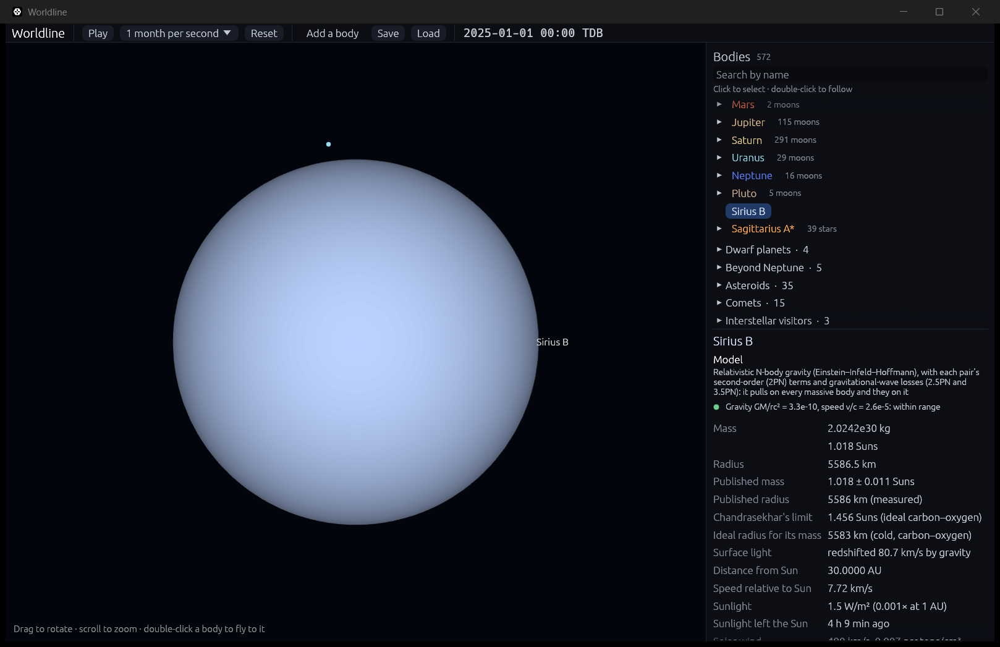

# White dwarfs and Chandrasekhar's limit

**Code:** `crates/worldline-core/src/white_dwarf.rs` (the Lane–Emden equation, Chandrasekhar's white-dwarf equation, the mass–radius relation and the limit), `crates/worldline-app/src/simulation.rs` (white dwarfs that grow, and explode)
**Tests:** `crates/worldline-data/tests/validation_white_dwarfs.rs`, plus unit tests in both code files
**Sources:**
- **The limit:** Chandrasekhar (1931), *ApJ* 74, 81.
- **The equation of state and the stars:** Chandrasekhar (1935), *MNRAS* 95, 207, and (1939), *An Introduction to the Study of Stellar Structure*, chapters IV (polytropes) and XI (white dwarfs).
- **Sirius B:** mass from its orbit, Bond et al. (2017), *ApJ* 840, 70; radius from its light and distance, Joyce et al. (2018), *MNRAS* 481, 2361.
- **What happens past the limit:** Hillebrandt & Niemeyer (2000), *ARA&A* 38, 191.

## Why it matters

When a star like the Sun runs out of fuel, its core shrinks until it is as dense as a tonne per cubic centimeter. No heat holds it up: the Pauli exclusion principle does. No two electrons can share a state, so packed electrons are forced into ever faster motion, and that motion pushes back. A white dwarf is a star held up by quantum mechanics.

In 1930, aged 19, Subrahmanyan Chandrasekhar saw that this has an end. A heavier white dwarf is smaller and denser, so its electrons move faster. Near the speed of light they push back less hard for each extra squeeze. Past about 1.4 Suns, no density holds the star up at all. He received the 1983 Nobel Prize for it. A carbon–oxygen white dwarf pushed toward that limit ignites its carbon and is destroyed in a thermonuclear explosion, a type Ia supernova. These are the "standard candles" that showed the universe's expansion is speeding up.

## The model

**The electrons' pressure** is exact for a cold, ideal electron gas (Chandrasekhar 1935). With x the electrons' Fermi momentum in units of mₑc:
- density ρ = μₑ mᵤ x³/(3π² λₑ³), where λₑ = ħ/(mₑc) and μₑ = 2 atomic mass units per electron for carbon and oxygen;
- pressure P = (mₑc²/λₑ³) φ(x), with φ(x) = [x√(1+x²)(2x²/3 − 1) + ln(x + √(1+x²))]/(8π²).

Slow electrons (x ≪ 1) give P ∝ ρ^(5/3); fast ones (x ≫ 1) only P ∝ ρ^(4/3), the softening behind the limit.

**The star** is in hydrostatic equilibrium. Written in y = √(1 + x²), the electrons' energy in units of mₑc², that becomes Chandrasekhar's white-dwarf equation:

(1/η²) d/dη(η² dφ/dη) = −(φ² − 1/y₀²)^(3/2),

with φ = y/y₀, y₀ its value at the center, and r = η/(y₀ √(4πkGρ₀)). The constants are k = μₑmᵤ/(mₑc²) and ρ₀ = μₑmᵤ/(3π²λₑ³). The surface is where y = 1. Worldline solves it for any central density with fourth-order Runge–Kutta, halving steps until each is accurate to 10⁻¹³, and finds the surface by Newton's method.

**The limit.** As the central density grows without bound, the equation becomes the Lane–Emden equation of index 3. Its constant ω₃ = −ξ₁²θ′(ξ₁) = 2.01824 gives the largest mass:

M_Ch = (√(3π)/2) ω₃ (ħc/G)^(3/2)/(μₑ mᵤ)² = **1.456 Suns** for carbon and oxygen.

The same solver gives the Lane–Emden constants, so the limit isn't typed in.

**The mass–radius relation** (cold, ideal carbon–oxygen white dwarfs). Heavier white dwarfs are smaller:

| Mass (Suns) | 0.2 | 0.4 | 0.6 | 0.8 | 1.0 | 1.2 | 1.3 | 1.4 | 1.45 |
|---|---|---|---|---|---|---|---|---|---|
| Radius (km) | 14,657 | 10,969 | 8,841 | 7,200 | 5,716 | 4,165 | 3,245 | 1,986 | 705 |

**"Ideal"**, as Chandrasekhar computed it, leaves out:
- **the star's heat,** which puffs it up;
- **the electrons' attraction to the nuclei** (the Coulomb correction), which shrinks it;
- **general relativity, and electrons captured by nuclei,** which make the real maximum mass a little lower.

For Sirius B, the first two are each of order 1%.

## In the app

**For a white dwarf,** the inspector shows Chandrasekhar's limit, and the radius an ideal white dwarf of its mass has. For Sirius B that is 5,583 km, beside its measured 5,586.

**A white dwarf that grows** in a merger (say it swallows a planet) takes the radius the model gives its new mass, and shrinks: Sirius B, after swallowing a Jupiter, is 5,576 km. Before, a merged body took the volume of both, which is wrong for a white dwarf.

**One pushed past the limit explodes.** A carbon–oxygen white dwarf nearing the limit ignites carbon at its center, and the flame destroys the whole star, leaving nothing (Hillebrandt & Niemeyer 2000). The white dwarf is removed, and the top bar reports it: "Sirius B passed Chandrasekhar's limit (1.456 Suns) and exploded as a type Ia supernova: all 2.037 Suns flung out at about 10,000 km/s (the debris isn't simulated)".
- **Labeled:** the debris isn't simulated (that needs fluids, milestone 4). Real white dwarfs ignite slightly below the ideal limit.
- **One exception:** a white dwarf that has absorbed the Sun holds the place everything is measured from, so it stays, with a note.

To see it: `cargo run --release -- --add "Sirius B:30" --focus "Sirius B" --paused`.

## Validation (`cargo test`)

`cargo test --release -p worldline-data --test validation_white_dwarfs -- --nocapture` and `cargo test --release -p worldline-core white_dwarf -- --nocapture`:

| Check | Expected | Result |
|---|---|---|
| **Chandrasekhar's limit, carbon and oxygen** (the roadmap's) | 1.46 Suns | **1.4563 Suns** |
| Lane–Emden constants ξ₁ and −ξ₁²θ′(ξ₁) | exact for n = 0 (√6, 2√6) and n = 1 (π, π); n = 3/2: 3.65375, 2.71406 and n = 3: 6.89685, 2.01824 (Chandrasekhar 1939), within half a unit of their last digit | 3.653754, 2.714055; 6.896849, 2.018236; n = 0 and 1 exact |
| Ever denser white dwarfs (x = 1, 10, 100, 1,000) | approach the limit from below, short by about 1/x² (the equation of state's first correction); a wrong one wouldn't approach it. Passes if the shortfall falls faster than 1/x | 0.510, 1.3947, 1.45551, 1.45629 Suns: short by 0.65, 4.2 × 10⁻², 5.4 × 10⁻⁴, 5.5 × 10⁻⁶, falling as x^−1.89 then x^−2.00 |
| Light white dwarfs (x = 0.03, 0.01) | the n = 3/2 polytrope's M R³ = 4π ω ξ₁³ (5K/8πG)³, to corrections of order x²; passes below x | off by 0.5 x² at both |
| **Sirius B:** the radius of an ideal white dwarf of its measured mass, 1.018 ± 0.011 Suns | its measured radius, 0.00803 ± 0.00011 Sun radii, within the combined uncertainty (radius, and mass through the mass–radius relation) | 0.00803 Sun radii (5,583 km against 5,586): 0.03σ off |
| Heavier is smaller; nothing at or past the limit | 0.6 Suns larger than 1.2; none at 1.456 or 1.5 | 8,841 and 4,165 km; none |
| In the app: Sirius B swallows a Jupiter, then a second Sirius B | shrinks to the model's radius for 1.019 Suns; then explodes and is gone | 5,576 km; exploded |
