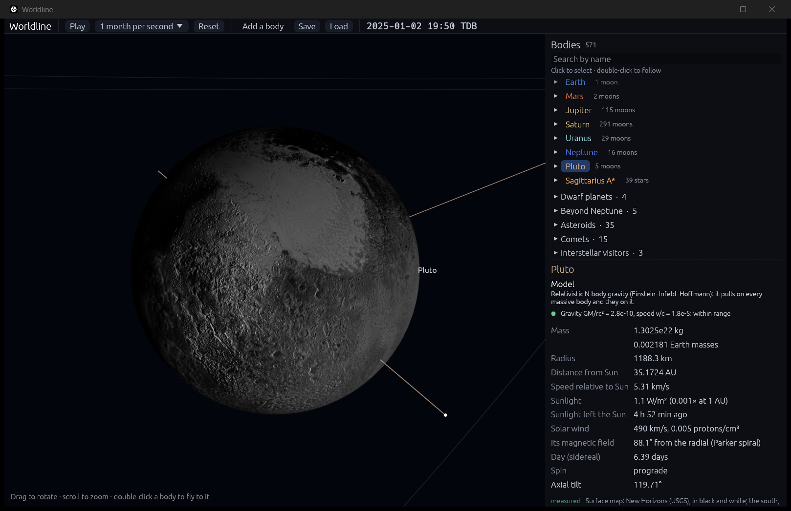

# Rendering globes

**Code:**
- `crates/worldline-render/`: the GPU renderer (meshes, the `bodies.wgsl` shader, mipmaps);
- `crates/worldline-app/src/gpu.rs`, `textures.rs` and `details.rs`: connecting it to the app.

When a body is big enough on screen to see, at least 3 points across, Worldline stops drawing it as a dot and draws it as a textured, lit, rotating globe on the GPU. This is the first piece of the "detail follows focus" principle (see [ARCHITECTURE.md](ARCHITECTURE.md)).

## How a frame is drawn

The 3D view is drawn in three layers:

1. **Back, on the CPU through egui:** reference rings, orbit trails and the Sun's glow.
2. **Middle, on the GPU (`worldline-render`):** drawn into an offscreen image that is transparent everywhere else. egui then paints that image over the back layer, so trails pass behind planets naturally. Three pipelines run in order:
   - **globes:** opaque, writing depth;
   - **atmospheres:** translucent shells;
   - **rings:** translucent quads.

   The translucent layers blend over what's behind them and are hidden by nearer surfaces.
3. **Front, on the CPU through egui:** dots for bodies too small to see, spin axes, and labels. A dot is hidden if a nearer globe covers it.

## Precision across 12 orders of magnitude

The view spans from the camera a few thousand kilometers above Earth out to Pluto, 5 × 10⁹ km away. Two techniques keep that precise on a GPU that works in single precision:

- **Camera-relative positions.** The app subtracts the camera's position from every body in double precision, so the GPU only ever sees distances from the camera. Earth's center 25,000 km away is exact to under a meter in single precision.
- **Reversed, infinite depth buffer.** Depth is stored as a 32-bit float that's 1 at the near plane and falls toward 0 at infinity. Floats are densest near 0, which is where the far distances land, so precision stays even across the whole range. There's no far plane at all. The near plane sits halfway to the closest surface.

## Surfaces

- **Maps:** 2K (2048 × 1024) equirectangular maps. The Sun's and planets' are from Solar System Scope (CC BY 4.0); the major moons', Pluto's, Charon's and Ceres's are spacecraft mosaics (see [Spacecraft maps](#spacecraft-maps) and [CREDITS.md](../CREDITS.md)). Longitude 0° is in the middle, east to the right, so the IAU prime meridian lines up with the map. Venus uses the cloud-top map, since that's what you'd see.
- **Planetocentric latitude:** the map is looked up by the direction from the body's center, the latitude the IAU and the spacecraft maps use. On a squashed body that differs from the latitude on the unstretched sphere, by up to 2.5° on Ceres (polar radius 8% short).
- **Real rotation:** each globe is turned by its IAU orientation for the current moment (see [physics/rotation.md](physics/rotation.md)). So Earth's continents turn once per 23.93 hours, Uranus rolls on its side, and Venus turns backwards.
- **Map lookup per pixel.** Longitude and latitude are worked out per pixel from the body's own frame, so there's no stretching at the poles from the mesh.
- **No seam at ±180°.** At ±180° longitude the map's coordinate jumps from 1 back to 0, which would normally draw a visible line. The shader takes its sampling rate from a copy of the coordinate whose jump is on the opposite side (Tarini 2012).
- **Mipmaps averaged in linear light.** Every map gets a full chain of half-size copies, so a distant planet samples a properly averaged image instead of sparkling. The 2 × 2 averaging happens in linear light, not on raw sRGB values, so colors don't darken as they shrink. A unit test checks that black and white average to sRGB 188, not 128.
- **Loaded only when needed.** A map is decoded and uploaded the first time its body becomes a globe. Bodies you never zoom in on never cost memory.
- **4× multisampling** smooths planets' edges.

## Spacecraft maps

14 bodies have maps made from spacecraft images: Io, Europa, Ganymede and Callisto (Galileo and Voyager), Titan, Enceladus, Tethys, Dione, Rhea and Iapetus (Cassini, with Voyager filling gaps), Triton (Voyager 2, the only one in color), Pluto and Charon (New Horizons) and Ceres (Dawn). They are global mosaics published by the USGS Astrogeology Science Center and NASA's Planetary Data System, public domain.

`tools/fetch_spacecraft_maps.py` (Python standard library only) makes them:
- **Streams** each mosaic (8 MB to 310 MB) without saving it, and **averages** it down to 2048 × 1024: each output pixel is the plain mean of the source pixels whose centers fall inside it. Pixels marked "no data" (0 in these products) are left out of the mean; some mosaics pad their edge with them, which otherwise darkens a line down the 0° meridian. PNG keeps the result exact.
- **Places each map from its own label**: the corner coordinates, pixel size and radius, not the label's "center longitude". Labels don't agree on a convention: Enceladus's says it is centered on 180° but its image starts there, so it is really centered on 0°. Reading the corner gets every map right.
- **Fills nothing in.** What no spacecraft photographed stays black: Pluto's and Charon's south (in winter darkness when New Horizons flew by in 2015), Triton's north (dark in 1989), Callisto's polar corners. The inspector says so.

Two things the maps are not:
- **Not true color.** Most are black and white (clear filters). Triton's shows Voyager's orange, violet and ultraviolet images as red, green and blue, close to but not quite what the eye would see.
- **Not measured brightness.** Each mosaic is stretched to show terrain. Iapetus is the striking case: its leading side is really about 10 times darker than its trailing side (Spencer & Denk 2010), but the mosaic evens that out. The inspector says this too.

Titan's map shows its surface in near-infrared, through the haze, as Cassini's cameras saw it; to the eye Titan is a featureless orange haze, and the inspector says that.

## Shapes

Bodies are ellipsoids with their IAU radii (`BODYnnn_RADII` in NASA NAIF's kernel), so Saturn is visibly squashed (9.8%) and Jupiter slightly (6.5%). The vertex shader stretches a unit sphere by the three radii. Normals come from the position divided by the radii, which is exact for an ellipsoid.

## Up-close details

Each body's inspector panel lists what's shown and what kind of knowledge it is: **measured**, **model** or **visual** (`details.rs`).

- **Earth's clouds.** One cloud snapshot from Solar System Scope, based on NASA data, so not live weather. Clouds are white, lit like the ground, and hide the city lights beneath them.
- **Earth's atmosphere.** A shell 60 km thick is ray-marched per pixel. Single-scattering Rayleigh, after Nishita et al. (1993):
  - along the line of sight, sunlight is scattered toward the camera by air whose density falls as e^(−h/8 km);
  - the light is dimmed on its way in (8 steps toward the Sun, zero if the planet is in the way) and on its way out;
  - scattering coefficients are Earth's sea-level values (5.8, 13.5, 33.1) × 10⁻⁶ m⁻¹ for red, green and blue (Bruneton & Neyret 2008), which follow Rayleigh's 1/λ⁴ law (a unit test checks the ratios);
  - the result is in the same units as the lit surfaces, so there's no fudge factor.

  It produces the blue haze over the oceans and the thin blue limb.
- **Saturn's rings.** Cassini's measured ring profile, with slanted-path transparency, shadows both ways, and mipmaps that blur the rings into bands from afar. See [physics/saturn-rings.md](physics/saturn-rings.md).
- **The Sun's corona.** A glow out to 3 solar radii shaped by the Baumbach (1937) K-corona model, I(ρ)/I₀ = 10⁻⁶ (0.0532 ρ^−2.5 + 1.425 ρ^−7 + 2.565 ρ^−17). It's a million times fainter than the disk (only visible in total eclipses), so it's drawn on a log scale, labeled as boosted.
- **Jupiter.** The map's bands and Great Red Spot turn with Jupiter's 9.9-hour IAU rotation. The spot's place on the map is fixed, whereas the real one drifts in longitude over the years; that's labeled.

## Light

| Effect | Model | Kind |
|---|---|---|
| Sunlight on planets | Lambert: brightness ∝ cos(angle from overhead), lit from the Sun's actual direction | physics model |
| Earth's city lights | NASA night-lights map, fading in just past the day/night line | measured data |
| Sun's limb darkening | the Sun's edge looks dimmer because we see higher, cooler gas there. Eddington approximation: I(μ)/I(1) = 0.4 + 0.6 μ | physics model |
| 1% fill light on night sides | keeps the dark side from vanishing completely | visual aid, labeled in the app |
| Earth's sky | single-scattering Rayleigh with measured coefficients | physics model |
| Saturn's ring light and shadows | see [saturn-rings.md](physics/saturn-rings.md) | physics model |
| Sun's corona | Baumbach model, brightness boosted | physics model (boosted) |
| Sun's surface colors | Solar System Scope map, stylized orange (the real Sun is white) | visual, labeled in the app |

## Checks

- **CI, without a GPU:**
  - the shader is compiled and validated with naga, the same compiler wgpu uses;
  - the uniform-buffer layout matches the shader's padding rules;
  - the depth projection maps the near plane to 1 and infinity to 0;
  - the sphere's triangles all face outward;
  - mipmaps average in linear light;
  - all the bundled maps decode at 2048 × 1024, and every spacecraft map has its inspector line;
  - every mipmap level size follows the GPU's halving rule (a test added after a real crash: the ring profile's 7,222 bins need exactly 13 levels).
- **Physics** (`validation_rotation.rs`): the Sun is overhead at **23.00°S, 178.76°W** at 2025-01-01 00:00 TDB. That's the Sun's declination on January 1, and local noon over the date line at midnight in Greenwich. It puts the day/night line where it really was.
- **Maps in place** (`crates/worldline-app/tests/validation_maps.rs`):
  - landmarks from the IAU Gazetteer of Planetary Nomenclature fall on the right terrain: Sputnik Planitia on Pluto, Cerealia Facula on Ceres, Xanadu on Titan and Roncevaux Terra on Iapetus are brighter than their map's average and than the same spot on a map turned halfway round (the mistake a label's center longitude invites); Loki Patera on Io is darker;
  - Iapetus heads toward 94.2°W in the simulation, and that half of its map is the darker (0.88 times as bright; the real contrast is about 10 times, which the mosaic evens out);
  - Pluto and Charon face each other within 0.023° of longitude 0°, inside one map pixel (0.176°), so the point facing away from Charon lies in Sputnik Planitia, 19.5° from its center. With NAIF's pck00011 values this measured 1.5°, which is how Worldline found the error the New Horizons team had corrected (see [physics/rotation.md](physics/rotation.md)).
- **By eye:** at the start date, Australia and the Pacific are in daylight and Antarctica in its 24-hour summer sun. Europe and North Africa show city lights in the middle of their night.

## Next

Step 1b.4 adds the major moons, with hierarchical integration.
